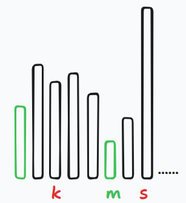
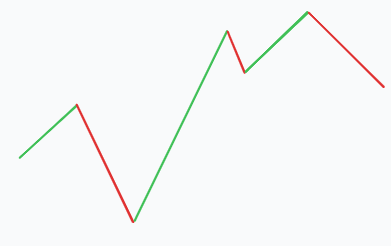
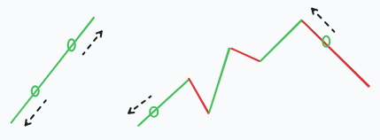
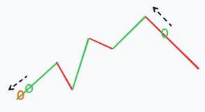



# leetcode动态规划

## || 理论

* 具有重叠子问题，明确子问题含义
* 写出递归方程（状态转移方程）
* 使用簿记变量以及确定初始化值

> 很熟悉了不再赘述

## || leetcode题目

### 509.斐波那契数

<https://leetcode.cn/problems/fibonacci-number/>

斐波那契数 （通常用 F(n) 表示）形成的序列称为 斐波那契数列 。该数列由 0 和 1 开始，后面的每一项数字都是前面两项数字的和。也就是：

    F(0) = 0，F(1) = 1
    F(n) = F(n - 1) + F(n - 2)，其中 n > 1

给定 n ，请计算 F(n) 。

*题解：*

没什么好解的，用两个变量递推就是了。

```cpp
class Solution {
public:
    int fib(int n) {
        int f1 = 1, f2 = 0;
        if(n == 0 || n == 1)
            return n;
        for(int i = 2; i <= n; i++){
            f2 = f1 + f2; 
            std::swap(f1, f2);
        }
        return f1;
    }
};
```

官方题解里还有两个有趣的解法，这里简单说说：

1. 直接写出齐次线性方程通解
2. 矩阵快速幂，就是写出矩阵递归形式，完了求$M^n$，就是个简单2分n的快速幂求乘法。

### 70.爬梯子

<https://leetcode.cn/problems/climbing-stairs/>

假设你正在爬楼梯。需要 n 阶你才能到达楼顶。

每次你可以爬 1 或 2 个台阶。你有多少种不同的方法可以爬到楼顶呢？

*题解：*

状态方程可写为：

$$
dp[n] = dp[n-1] + dp[n-2]
$$

$dp[n]$表示高为$n$的阶梯有多少种走法。

和上一题斐波那契数列完全相同，只是初始值不同，这里直接用上一题的代码改一改。

```cpp
class Solution {
public:
    int climbStairs(int n) {
        int f1 = 1, f2 = 1;
        if(n == 1)
            return n;
        for(int i = 2; i <= n; i++){
            f2 = f1 + f2; 
            std::swap(f1, f2);
        }
        return f1;
    }
};
```

### 746. 使用最小花费爬楼梯

<https://leetcode.cn/problems/min-cost-climbing-stairs/>

给你一个整数数组 cost ，其中 cost[i] 是从楼梯第 i 个台阶向上爬需要支付的费用。一旦你支付此费用，即可选择向上爬一个或者两个台阶。

你可以选择从下标为 0 或下标为 1 的台阶开始爬楼梯。

请你计算并返回达到楼梯顶部的最低花费。

*题解*

> 看似和上两题有点类似，但子问题含义完全不一样

设$dp[s]$为`s`阶楼梯的最小花费，状态转移方程为：

$$
dp[s] = min
\begin{cases}
dp[s-1] + cost[s-1],\\
dp[s-2] + cost[s-2]
\end{cases} \\
dp[0] = 0, dp[1] = 0
$$

需要注意**初始值**，由于可以从下标0或1直接开始，所以初始值为0

```cpp
class Solution {
public:
    int minCostClimbingStairs(vector<int>& cost) {
        // -1, -2
        int dp1 = 0, dp2 = 0;
        for(int i = 2; i <= cost.size(); i++){
            dp2 = std::min(dp1 + cost[i - 1], dp2 + cost[i - 2]);
            std::swap(dp1, dp2);
        }
        return dp1;
    }
};
```

### 62. 不同路径

<https://leetcode.cn/problems/unique-paths/>

一个机器人位于一个 m x n 网格的左上角 （起始点在下图中标记为 “Start” ）。

机器人每次只能向下或者向右移动一步。机器人试图达到网格的右下角（在下图中标记为 “Finish” ）。

问总共有多少条不同的路径？

*题解*

首先想到的是动规，再加上滚动数组优化，代码如下：

```cpp
class Solution {
public:
    int uniquePaths(int m, int n) {
        std::vector<int> dp(m, 1);
        for(int i = 0; i < n - 1; i++){
            for(int j = 1; j < m; j++){
                dp[j] += dp[j-1];
            }
        }
        return dp[m-1];
    }
};
```

不用滚动数组，最原始的`dp[i][j]`的含义为，从`(i, j)`出发走到终点有多少条路径。状态转移方程太简单不在赘述。

官方题解中还有一种使用组合数学的方法，走到终点一定要`m+n-2`步，而向下一定要走`m-1`步，当我们确定了`m+n-2`中何时向下走的`m-1`步，
剩下的`n-1`步自然就是向右走的。

所以问题变为了从`m+n-2`中选择`m-1`个数，求$C_{m+n-2}^{m-1}$

> 求组合数注意溢出

### 63. 不同路径 II

<https://leetcode.cn/problems/unique-paths-ii/>

一个机器人位于一个 m x n 网格的左上角 （起始点在下图中标记为 “Start” ）。

机器人每次只能向下或者向右移动一步。机器人试图达到网格的右下角（在下图中标记为 “Finish”）。

现在考虑网格中有障碍物。那么从左上角到右下角将会有多少条不同的路径？

网格中的障碍物和空位置分别用 1 和 0 来表示。

*题解*

这题和上一题思路一致，动规加滚动数组优化。

但需要注意两点：

1. 有障碍物的地方`dp[i][j]`可以置为0，不影响状态转移方程（反正都是左+右，为0正好对应走不通）

2. 初始值，对于最后一行，只有存在一个障碍物，那么障碍物之前的`dp`的值也为0，因为现在只向右边走，走不通了


代码如下：

```cpp
class Solution {
public:
    int uniquePathsWithObstacles(vector<vector<int>>& obstacleGrid) {
        int m = obstacleGrid.size(), n = obstacleGrid[0].size();
        std::vector<int> dp(n, 1);

        int i;
        for(i = n-1; i >=0; i--){
            if(obstacleGrid[m - 1][i] == 1){
                break;
            }
        }

        while(i >= 0){
            dp[i] = 0;
            i--;
        }

        for(int i = m - 2; i >=0 ; i--){
            if(obstacleGrid[i][n - 1] == 1){
                dp[n - 1] = 0;
            }
            for(int j = n - 2; j >= 0; j--){
                if(obstacleGrid[i][j] == 1){
                    dp[j] = 0;
                }else{
                    dp[j] += dp[j + 1];
                }
            }
        }
        return dp[0];
    }
};
```

> 上一题是用的列dp，这里由于`obstacleGrid`是行主序的，这里改成了行dp最大化利用cache。

> 另外第一次提交`int`溢出了改成`long long`通过

### 343. 整数拆分

<https://leetcode.cn/problems/integer-break/>

给定一个正整数 n ，将其拆分为 k 个 正整数 的和（ k >= 2 ），并使这些整数的乘积最大化。

返回 你可以获得的最大乘积 。


*题解*

最开始的做法搞复杂了，设`dp[k][n]`表示n拆为k个数时最大乘积。

状态转移方程为：

$$
dp[k][n] = max_{1<=i<=n-k+1}(i*dp[k-1][n-i])
$$

其初始值和遍历顺序见代码：

```cpp
#define INX(x, y) (x)*(n+1) + (y)

class Solution {
public:
    int integerBreak(int n) {
        int* dp = new int[(n+1)*(n+1)];
        int ret = 1;
        // initializing
        for(int i = 2; i <= n; i++){
            dp[INX(2, i)] = (i / 2) * (i - i / 2);
            if(dp[INX(2, i)] > ret)
                ret = dp[INX(2, i)];
        }

        for(int i = 3; i <= n; i++){
            for(int j = 3; j <= n; j++){
                int tmp_max = 1, tmp;
                for(int k = 1; k <= j - i + 1; k++){
                    tmp = dp[INX(i-1, j-k)] * k;
                    if(tmp > tmp_max)
                        tmp_max = tmp;
                }
                dp[INX(i, j)] = tmp_max;
                if(tmp_max > ret)
                    ret = tmp_max;
            }
        }

        return ret;
    }
};
```

如果说这题要求k的个数到也勉强说的过去。

> 其实可能多个不同的k的乘积一样大，所以这里没有要求k

再说标准的做法，设`dp[n]`为至少拆成2个数时的最大乘积。

状态转移方程为：

$$
dp[n] = j*max_{1<=j<n}(i-j, dp[i-j])
$$

之所以有个`i-j`是`dp[k]`含义为至少拆成2，所以`j*dp[i-j]`表示至少拆成3个数，没有考虑拆成两个的情况，所以这里有个`j*(i-j)`

```cpp
class Solution {
public:
    int integerBreak(int n) {
        vector <int> dp(n + 1);
        for (int i = 2; i <= n; i++) {
            int curMax = 0;
            for (int j = 1; j < i; j++) {
                curMax = max(curMax, max(j * (i - j), j * dp[i - j]));
            }
            dp[i] = curMax;
        }
        return dp[n];
    }
};
```

最后这里其实有一种巧妙的解法，如果拆成的乘积中存在因数$f>=4$，那么f总能被拆为2*(f-2)
因为$2f-4>=4$，所以最大乘积中一定只能被拆为1、2、3的组合，而如果存在1又总能被加到2或者3上重新拆，所以最后结果只需要2、3就能组合成。

但其实最终结果中2的次数不会多于两次，因为$2*2*2 < 3*3$。

所以可能的最大乘积的组合一定只会是以下3种可能：

* $3*3*3...*3$
* $2*3*3*3...*3$
* $2*2*3*3*3...*3$

并且这三种可能是不能相互转换的，$3^k = 2*3^m$ => $3^{k-m}=2$显然不成立，另一个等式同理。

所以，只要求出其中一种可能就只能是这种，不可能是其他两种。而恰好直接除3，根据余数情况可以分别得出这三种情况：

```cpp
class Solution {
public:
    int integerBreak(int n) {
        if(n <= 3)
            return (n/2) * (n - n/2);
        int r = n % 3, p = n / 3;
        if(r == 0)
            return pow(3, p);
        if(r == 1)
            return 4 * pow(3, p - 1);
        return 2 * pow(3, p);
    }
};
```

### 96.不同的二叉搜索树

<https://leetcode.cn/problems/unique-binary-search-trees/>

给你一个整数 n ，求恰由 n 个节点组成且节点值从 1 到 n 互不相同的**二叉搜索树**有多少种？返回满足题意的二叉搜索树的种数。

题解：

需要观察到题中为二叉排序树数量。如此一来根据排序树的性质（左子树所有值小于root，右子树所有值大于root，且左右子树也是排序树），就很容易发现子问题了。

设`dp[k]`为当`n=k`时，二叉排序树的数量，其状态转移方式如下：

$$
dp[k] = \sum_{i=1}^{k}dp[i-i]*dp[k-i] \\
dp[0] = 1, dp[1] = 1
$$

通俗来说，当有`n`个节点时，可以设根节点为`k`由于节点的值是`1~n`，所以按照排序树的性质，左子树的值一定是小于`k`的，右子树一定是大于`k`

所以左子树变为了有`k-1`的节点时，有多少种排序树（这就是子问题了）。知道知道左右子树相乘极为根为`k`的情况，把`k`从`1~n`遍历一遍相加就得到答案了。


```cpp
class Solution {
public:
    int numTrees(int n) {
        std::vector<int> dp(n+1, 1);
        for(int k = 2; k <= n; k++){
            dp[k] = 0;
            for(int i = 1; i <= k; i++){
                dp[k] += dp[i-1] * dp[k-i];
            }
        }
        return dp.back();
    }
};
```

这道题比较有意思的是它的数学解法，其实就是卡特兰数（这里的递归推道出来的，没有去证明了）。

我想说的是，关于`n`个数字按顺序入栈有多少种出栈顺序，虽然知道结果是卡特兰数但一直不知道怎么来的。那么这里这种递归（动态规划）可以认为是一种做法。和这里一样，但root根就是以某个数出栈来算了(前面的是出栈顺序和后面的出栈顺序)。

### 416. 分割等和子集

<https://leetcode.cn/problems/partition-equal-subset-sum/>

给你一个 只包含正整数 的 非空 数组 nums 。请你判断是否可以将这个数组分割成两个子集，使得两个子集的元素和相等。

*题解*

必须要先转化一下题目，首先如果可以分解为两个相等的子集，则`sum(nums)`必须可以整除2才能划分。

如果能够被整除，设`target = sum(nums)/2`，并且现在问题转化为了能否从集合中找到和为`target`的子集，这变成经典的01背包问题了。

我最初的想法如下，设`dp[i][t]`为从`0-i`集合中能否（`true or false`）找到和为`t`的子集，转移方程如下：

$$
dp[i][t] =
\begin{cases}
dp[i-1][t], t < nums[i]\\
dp[i-1][t- nums[i]] + nums[i], t >= nums[i] \\
\end{cases}
$$

并且考虑到`target`可能很大就没有去用完整的数组，以及自下而上的方式，而是自上而下的。代码如下：

```cpp
class Solution {
public:
  std::vector<std::unordered_map<int, bool>> dp;
  bool canPartition(vector<int> &nums) {
    int sum = 0;
    for (auto num : nums)
      sum += num;

    if (sum % 2 != 0)
        return 0;
    int target = sum / 2;
    dp.resize(nums.size());
    return _recur(nums, nums.size() - 1, target);
  }

  bool _recur(vector<int> &nums, int idx, int target) {
    if(target < 0)
      return false;

    auto& memo = dp[idx];
    if(memo.count(target) > 0)
      return memo[target];

    if(idx == 0){
      memo[target] = nums[idx] == target;
    }else
      memo[target] = _recur(nums, idx - 1, target - nums[idx]) || _recur(nums, idx - 1, target);
    return memo[target];
  }
};
```

过倒是能过就是慢了一点。

其实这里`1 <= nums[i] <= 100`，不算大还是使用常规的自下而上，再加上滚动数组优化好了。

这里稍微有点不一样，`dp[i][t]`是按照背包的思维，为此时能放的最大值，最后再来判断是否和`target`相等。

> 其实用我上面的`bool`也是一样的，懒得去改了

```cpp
class Solution {
public:
  bool canPartition(vector<int> &nums) {
    int sum = 0;
    for (auto num : nums)
      sum += num;

    if (sum % 2 != 0)
        return 0;
    int target = sum / 2;
    int n = nums.size();
    vector<int> dp(target+1, 0);
    for(int i = 1; i <= n; i++){
        for(int t = target; t >= 0 ; t--){
            if(t >= nums[i-1])
                dp[t] = max(dp[t], dp[t-nums[i-1]] + nums[i-1]);
        }
    }
    return dp[target] == target;
  }
};
```

### 1049. 最后一块石头的重量 II

<https://leetcode.cn/problems/last-stone-weight-ii/>

有一堆石头，用整数数组 stones 表示。其中 stones[i] 表示第 i 块石头的重量。

每一回合，从中选出任意两块石头，然后将它们一起粉碎。假设石头的重量分别为 x 和 y，且 x <= y。那么粉碎的可能结果如下：

如果 x == y，那么两块石头都会被完全粉碎；
如果 x != y，那么重量为 x 的石头将会完全粉碎，而重量为 y 的石头新重量为 y-x。
最后，最多只会剩下一块 石头。返回此石头 最小的可能重量 。如果没有石头剩下，就返回 0。

*题解*

这道题麻烦在要对题目做个转化，说白了就是要把石头分成两堆，然后其对撞粉碎，差值最小。

分成两堆差值要最小，要么可以平分，不能平分那么一定一堆比一半大，一堆比一半小。

所以变为了背包问题，设`target = sum(nums) / 2`，从所有石头中选择出不超过`target`的最大值。

几乎和上一题分割子集合一样。

```cpp
class Solution {
public:
    int lastStoneWeightII(vector<int>& stones) {
        int sum = 0;
        for(auto w : stones)
            sum += w;
        int target = sum / 2;
        std::vector<int> dp(target + 1, 0);
        for(int i = 1; i <= stones.size(); i++){
            for(int t = target; t >= stones[i - 1]; t--){
                dp[t] = max(dp[t], dp[t - stones[i - 1]] + stones[i - 1]);
            }
        }
        return sum - dp[target] - dp[target];
    }
};
```

### 494. 目标和

<https://leetcode.cn/problems/target-sum>

给你一个非负整数数组 nums 和一个整数 target 。

向数组中的每个整数前添加 '+' 或 '-' ，然后串联起所有整数，可以构造一个 表达式 ：

例如，nums = [2, 1] ，可以在 2 之前添加 '+' ，在 1 之前添加 '-' ，然后串联起来得到表达式 "+2-1" 。
返回可以通过上述方法构造的、运算结果等于 target 的不同 表达式 的数目。

*题解*

首先这题很容易想到如下的动态规划，设`dp[i][t]`为从前`i`个数（包含[0~i]）中结果为`t`的数量。

状态转移方程为：

$$
dp[i][t] = dp[i-1][t-v] + dp[i-1][t+v]
$$

> 初始条件见代码，这里没有写

由于这里不能使用滚动优化，而且自下而上的话也不好确定数组长度，所以这里自上而下。

```cpp
class Solution {
public:
    vector<unordered_map<int, int>> dp;
    int findTargetSumWays(vector<int>& nums, int target) {
        dp.resize(nums.size());
        return _recur(nums, nums.size() - 1, target);
    }

    int _recur(vector<int>& nums, int index, int target) {
        if(index < 0)
            return 0;
        auto& memo = dp[index];
        if(memo.count(target))
            return memo[target];
        if(index == 0){
            memo[target] = nums[index] == abs(target) ? 1 : 0;
            // 都为0时，正负号均可
            if(target == 0 && nums[index] == 0)
                memo[target] = 2;
        }else{
            memo[target] = _recur(nums, index - 1, target - nums[index]) + _recur(nums, index - 1, target + nums[index]);
        }
        return memo[target];
    }
};
```

需要注意初始条件，当`nums[0]`为0时，正负号均可，所以初始为2。

看了其他的题解，发现又可以转换为背包问题，其实划分为两个子集（全正的和全负的），设全正的和为x则有

$$
x - (sum - x) = target \\
x = (target + sum) / 2
$$

由此可知`target + sum`一定要整除2，不然不可能。

所以现在问题变为了从其中选择和为x的子集有多少种。故设`dp[i][t]`为和为t的种数，状态转移方程为：

> 这里i为0~(n-1)

$$
dp[i][t] = dp[i-1][t] + dp[i-1][t-nums[i]]
$$

> 初始化见代码

```cpp
class Solution {
public:
    int findTargetSumWays(vector<int>& nums, int target) {
        int sum = 0;
        for (auto num : nums){
            sum += num;
        }
        if(abs(target) > sum || (target + sum) %2 != 0)
            return 0;
        int x = (target + sum) / 2;
        vector<int> dp(x + 1, 0);
        dp[0] = 1;
        for(int i = 0; i < nums.size(); i++)
        {
            for(int t = x; t >= nums[i]; t--)
            {
                dp[t] += dp[t - nums[i]];
            }
        }
        return dp[x];
    }
};
```

必须注意这里的初始情况，非常不好理解。这里设`dp[0]=1`其实代表的含义应该是`dp[-1][0] = 1`就是一个都没有时，为0仍然算一种。

比如如果数组为`[0, 1], target =1`，那么其实有两种`1`和`0, 1`，所以必须要算前面这种不选的情况，然后递推自动累加。

### 474.一和零

<https://leetcode.cn/problems/ones-and-zeroes/>

给你一个二进制字符串数组 strs 和两个整数 m 和 n 。

请你找出并返回 strs 的最大子集的长度，该子集中 最多 有 m 个 0 和 n 个 1 。

如果 x 的所有元素也是 y 的元素，集合 x 是集合 y 的 子集 。


*题解*

这题是经典01背包问题，设`dp[i][m][n]`为题目要的最大子集长度。转移方程就不写了，直接看代码：

```cpp
class Solution {
public:
    int findMaxForm(vector<string>& strs, int m, int n) {
        #define DP(i, j) dp[(i)*(n+1)+(j)]
        int* dp = new int[(m+1)*(n+1)];
        memset(dp, 0, sizeof(int)*(m+1)*(n+1));
        for(int k = 1; k <= strs.size(); k++){
            int zeros = 0, ones = 0;
            for(auto c : strs[k-1]){
                if(c == '0') zeros++;
                else ones++;
            }
            for(int i = m; i >= zeros; i--){
                for(int j = n; j >= ones; j--){
                    DP(i, j) = std::max(DP(i, j), DP(i - zeros, j - ones) + 1);
                }
            }
        }
        return DP(m, n);
    }
};
```

### [完全背包问题基础]

完全背包其他和01背包都是一样的，只是现在每个物体有无限个可以拿。

设`dp[i][t]`为背包容量为t是从前i个物体中能得到的最大价值和，那么状态转移方程为：

$$
dp[i][t] = max(dp[i-1][t], dp[i][t-w[i]] + v[i])
$$

咋一看好像和01背包相同，但注意后一个为`dp[i][t-w[i]] + v[i]`而不是`i-1`。

所以从语义上来说`dp[i][t]`为要么在最终方案中`w[i]`一个都不拿，以及拿了一个后，还是从前`i`个物品(因为还可以拿`w[i]`)中拿时最大的值即`dp[i][t-w[i]]`

> 注意子问题向上推导时的逻辑性，拿了一个之后，如果最终结果中确实包含这么一个，`dp[i][t-w[i]] + v[i]`确实会更小。如果不包含，那么拿了一个后`dp[i][t-w[i]] + v[i]`将不会时最优质。

> 网上有什么先写出`dp[i][t] = max(dp[i-1][t], dp[i-1][t-w[i]] + v[i] +......+ dp[i-1][t-n*w[i]] + n*v[i])`
> 然后再去推导出这里我写的这个公式，不能说有问题吧。只是做题写递推式还要推导转道弯，确实也太麻烦了

### 518. 零钱兑换 II

<https://leetcode.cn/problems/coin-change-ii>

给你一个整数数组 coins 表示不同面额的硬币，另给一个整数 amount 表示总金额。

请你计算并返回可以凑成总金额的硬币组合数。如果任何硬币组合都无法凑出总金额，返回 0 。

假设每一种面额的硬币有无限个。 

题目数据保证结果符合 32 位带符号整数。

*题解*

同上，就是经典的完全背包问题。代码如下：

```cpp
class Solution {
public:
    int change(int amount, vector<int>& coins) {
        vector<int> dp(amount + 1, 0);
        dp[0] = 1;
        for(int i = 0;i < coins.size(); i++){
            for(int j = coins[i]; j <= amount; j++){
                dp[j] += dp[j - coins[i]];
            }
        }
        return dp[amount];
    }
};
```

这里需要注意的是滚动方程优化时的遍历顺序。由于递推方程`dp[i][t] = max(dp[i-1][t], dp[i][t-w[i]] + v[i])`需要用到上一次的，也需要用到这一次的。

所以这里必须从前往后遍历，这样`dp[t]`还是前一次的，但小于`t`的已经是这一次的值了。

### 377. 组合总和 Ⅳ

<https://leetcode.cn/problems/combination-sum-iv>

给你一个由 不同 整数组成的数组 nums ，和一个目标整数 target 。请你从 nums 中找出并返回总和为 target 的元素组合的个数。

题目数据保证答案符合 32 位整数范围。

示例 1：

```
输入：nums = [1,2,3], target = 4
输出：7
解释：
所有可能的组合为：
(1, 1, 1, 1)
(1, 1, 2)
(1, 2, 1)
(1, 3)
(2, 1, 1)
(2, 2)
(3, 1)
请注意，顺序不同的序列被视作不同的组合。
```

示例 2：
```
输入：nums = [9], target = 3
输出：0
```

*题解*

注意这个题看似是完全背包问题，但要求排列数而不是组合数。所以其实和背包问题关系不大。


最开始的想法是设`dp[i][t]`为末尾是`nums[i-1]`的排列数量，那么转移方程如下：

$$
dp[i][t] = \sum_{k=0}^{n}dp[k][t-nums[i-1]] \\
dp[0][0] = 1
$$

`dp[0][0]`表示一个都不选时，`target=0`数量，应该为1，什么都不选应该认为是一种。

并且`dp[k][t-v]`当t刚好等于v时，也代表一种，所以`dp[0][0]=1`

代码如下：

```cpp
class Solution {
public:
    int combinationSum4(const vector<int>& nums, int target) {
        int n = nums.size();
        vector<vector<int>> dp(n + 1, vector<int>(target + 1, 0));
        dp[0][0] = 1;
        for(int j = 1; j <= target; j++){
            for(int i = 1; i <= n; i++){
                if(j >= nums[i - 1]){
                    for(int k = 0; k <= n; k++){
                        if(dp[k][j-nums[i-1]] < INT_MAX - dp[i][j])
                            dp[i][j] += dp[k][j-nums[i - 1]];
                    }
                }
            }
        }
        int ret = 0;
        for(int i = 1; i <= n; i++){
            ret += dp[i][target];
        }
        return ret;
    }
};
```

此时答案就是以每种数结束的排列数之和。

> 关于这里的INT_MAX的使用其实非常牵强，就是`dp[i][j] + dp[k][j-nums[i-1]] < INT_MAX`，意思是下一次加法会溢出就不求了。但是没有为什么，不这样写就过不了会溢出。(官方题解就是这样写的)

> 最开始我改成long long也溢出，还以为想法有问题

查看官方题解后发现还有改进空间，`dp[t]`可以直接设为要求的目标，即从`nums`数组中和为`t`的排列数。

> 官方题解在写什么鬼东西？？？

然后子问题其实和我的想法是一样的，本质上还是以每个数为结束时的排列数情况。

$$
dp[t] = \sum_{k=0}{n-1}dp[t-nums[k]] \\
dp[0] = 1
$$

这里`dp[0]=1`就没什么实际含义了，只是`dp[t-nums[k]]`中`t`刚好等于`nums[k]`时应该算一种。

遍历顺序直接从小到大即可。

> 注意这里的`dp[t]`中`t`就是target，所以就是普通的dp数组，所以这个遍历顺序没啥。
> 网上有些题解非要和完全背包扯上关系，说什么求排列就是交换两层for的顺序，求组合就是普通背包的顺序，简直在放屁

```cpp
class Solution {
public:
    int combinationSum4(vector<int>& nums, int target) {
        int n = nums.size();
        vector<int> dp(target + 1, 0);
        dp[0] = 1;
        for(int j = 1; j <= target; j++){
            for(int i = 1; i <= n; i++){
                if(j >= nums[i - 1] && dp[j-nums[i-1]] < INT_MAX - dp[j]){
                    dp[j] += dp[j-nums[i - 1]];
                }
            }
        }

        return dp[target];
    }
};
```
### 322. 零钱兑换

<https://leetcode.cn/problems/coin-change>

给你一个整数数组 coins ，表示不同面额的硬币；以及一个整数 amount ，表示总金额。

计算并返回可以凑成总金额所需的 最少的硬币个数 。如果没有任何一种硬币组合能组成总金额，返回 -1 。

你可以认为每种硬币的数量是无限的。

*题解*

标准的完全背包问题，只初始值稍有不同，直接见代码:

```cpp
class Solution {
public:
    int coinChange(std::vector<int>& coins, int amount) {
        std::vector<int> dp(amount + 1, INT_MAX - 1);
        dp[0] = 0;
        for(int i = 1; i <= coins.size(); i++){
            for(int j = coins[i-1]; j <= amount; j++)
            {
                dp[j] = std::min(dp[j - coins[i-1]] + 1, dp[j]);
            }
        }
        return dp[amount] == INT_MAX - 1 ? -1 : dp[amount];
    }
};
```

这里求最小的值，需要使用`INT_MAX`作为初始值。

### 279.完全平方数

<https://leetcode.cn/problems/perfect-squares>

给你一个整数 n ，返回 和为 n 的完全平方数的最少数量 。

完全平方数 是一个整数，其值等于另一个整数的平方；换句话说，其值等于一个整数自乘的积。例如，1、4、9 和 16 都是完全平方数，而 3 和 11 不是。

*题解*

需要对问题做一个转换，可能构成和为n的完全平方数就是，`1,2,3....n^(0.5)`的每个数的平方，因为这些平方数才是小于n的。

所以现在和上一题完全一样了，就是在这个数组里找出和为n的最小数量。

```cpp
class Solution {
public:
    int numSquares(int n) {
        int up = std::sqrt(n);
        std::vector<int> dp(n + 1, INT_MAX - 1);
        dp[0] = 0;
        for(int i = 1;i <= up;i++){
            int elem = i * i;
            for(int j = elem; j <= n; j++){
                dp[j] = std::min(dp[j - elem] + 1, dp[j]);
            }
        }
        return dp[n] == INT_MAX - 1 ? 0 : dp[n];
    }
};
```
### 139. 单词拆分

<https://leetcode.cn/problems/word-break>

给你一个字符串 s 和一个字符串列表 wordDict 作为字典。如果可以利用字典中出现的一个或多个单词拼接出 s 则返回 true。

注意：不要求字典中出现的单词全部都使用，并且字典中的单词可以重复使用。

*题目*

首先想到的就是回溯法或者说dfs遍历，再加一个记忆变量减枝。这题也确实可以这么做。

第二个想到的就是把给出的wordDict转换成字典树方便比较。

这里毕竟是学习动规，所以再考虑动规，`dp[i]`就是前`s[0-i]`的字符串是否可以被表示。转移方程就很简单了：

$$
dp[i] = dp[j] && s[j+1, i] in wordDict
dp[0] = true
$$

其中`s[j+1, i]`表示一个再wordDict中的单词。

自底向上填充dp即可，代码如下：

```cpp
class Solution {
public:
    bool wordBreak(string s, vector<string>& wordDict) {
        vector<bool> dp(s.size() + 1, false);
        unordered_set<string> dict;
        for(auto& w : wordDict)
        {
            dict.insert(w);
        }

        dp[0] = true;
        for(int i = 1; i <= s.size(); i++){
            for(int j = 0; j < i; j++){
                string word = s.substr(j, i - j);
                if(dict.find(word) != dict.end() && dp[j]){
                    dp[i] = true;
                    break;
                }
            }
        }
        return dp[s.size()];
    }
};class Solution {
public:
    bool wordBreak(string s, vector<string>& wordDict) {
        vector<bool> dp(s.size() + 1, false);
        unordered_set<string> dict;
        for(auto& w : wordDict)
        {
            dict.insert(w);
        }

        dp[0] = true;
        for(int i = 1; i <= s.size(); i++){
            for(int j = 0; j < i; j++){
                string word = s.substr(j, i - j);
                if(dict.find(word) != dict.end() && dp[j]){
                    dp[i] = true;
                    break;
                }
            }
        }
        return dp[s.size()];
    }
};
```

如果使用字典树，内层循环就变成固定的`O(n)`了。这里内层是`O(n^2)`，因为`substr()`还要消耗`O(n)`

### 198. 打家劫舍

<https://leetcode.cn/problems/house-robber>

你是一个专业的小偷，计划偷窃沿街的房屋。每间房内都藏有一定的现金，影响你偷窃的唯一制约因素就是相邻的房屋装有相互连通的防盗系统，如果两间相邻的房屋在同一晚上被小偷闯入，系统会自动报警。

给定一个代表每个房屋存放金额的非负整数数组，计算你 不触动警报装置的情况下 ，一夜之内能够偷窃到的最高金额。

*题解*

过于简单，见代码：

```cpp
class Solution {
public:
    int rob(vector<int>& nums) {
        vector<int> dp(nums.size() + 1, 0);
        dp[1] = nums[0];
        for(int i = 2; i <= nums.size(); i++) {
            dp[i] = max(dp[i - 1], dp[i - 2] + nums[i - 1]);
        }
        return dp[nums.size()];
    }
};
```
### 213.打家劫舍II

<https://leetcode.cn/problems/house-robber-ii/>

你是一个专业的小偷，计划偷窃沿街的房屋，每间房内都藏有一定的现金。这个地方所有的房屋都 围成一圈 ，这意味着第一个房屋和最后一个房屋是紧挨着的。同时，相邻的房屋装有相互连通的防盗系统，如果两间相邻的房屋在同一晚上被小偷闯入，系统会自动报警 。

给定一个代表每个房屋存放金额的非负整数数组，计算你 在不触动警报装置的情况下 ，今晚能够偷窃到的最高金额。

*题目*

做这道题之前如果没有做过[198.打家劫舍](https://leetcode.cn/problems/house-robber/)，可能会感觉无从下手。尽管198非常简单。

这里由于多了一个限制条件，即头尾相邻，所以没法再用198那种子问题去求解了。

但是进一步考虑，如果最后一间被偷，那么`0和n-2`都不能被偷，但此时偷`1~n-3`就和198是同样的问题了。

同理如果最后一间不偷，那么`0~n-2`就变成198同样的问题了。

直接看代码:

```cpp
class Solution {
public:
    int rob(vector<int>& nums){
        return std::max(myrob(nums, 0, nums.size()-2), myrob(nums, 1, nums.size()-3) + nums.back());
    }

    // 198
    int myrob(vector<int>& nums, int start, int end){
        if(end < start){
            return 0;
        }
        int ns2 = 0, ns1 = nums[start];
        for(int i = start + 1; i <= end; i++){
            ns2 = std::max(ns1, ns2 + nums[i]);
            std::swap(ns1, ns2);
        }
        return ns1;
    }

};
```

### 337.打家劫舍 III

<https://leetcode.cn/problems/house-robber-iii/>

小偷又发现了一个新的可行窃的地区。这个地区只有一个入口，我们称之为 root 。

除了 root 之外，每栋房子有且只有一个“父“房子与之相连。一番侦察之后，聪明的小偷意识到“这个地方的所有房屋的排列类似于一棵二叉树”。 如果 两个直接相连的房子在同一天晚上被打劫 ，房屋将自动报警。

给定二叉树的 root 。返回 在不触动警报的情况下 ，小偷能够盗取的最高金额 。

*题解*

比较简单的动态规划，子问题其实就是这里要求的问题。应用是否偷当前节点来组合子问题和值，这里不写转移方程了，直接看代码：

```cpp
class Solution {
public:
    unordered_map<TreeNode*, int> memo;
    int rob(TreeNode* root) {
        if(root == nullptr)
            return 0;
        if(memo.count(root))
            return memo[root];
        int not_steal = rob(root->left) + rob(root->right);
        int steal_val = root->val;
        if(root->left)
            steal_val += rob(root->left->left) + rob(root->left->right);
        if(root->right)
            steal_val += rob(root->right->left) + rob(root->right->right);
        return memo[root] = max(not_steal, steal_val);
    }
};
```

这里其实就是深度优先遍历，空间复杂度就是树高，时间复杂度也是O(n)

但这里对于`rob()`的调用太多，并且需要使用一个HashMap。可以做如下优化，即直接返回选择当前节点和不选当前节点最优值来组合：

```cpp
class Solution {
public:
    std::pair<int, int> _rob(TreeNode* root){
        auto ret = std::make_pair(0, 0);
        if(root == nullptr){
            return ret;
        }
        auto l = _rob(root->left);
        auto r = _rob(root->right);
        ret.first = root->val + l.second + r.second;
        // 注意这行，求不选当前节点的最大值时，子节点不一定要选，也可以不选。
        ret.second = max(l.first, l.second) + max(r.first, r.second);
        return ret;
    }
    int rob(TreeNode* root) {
        auto ret = _rob(root);
        return max(ret.first, ret.second);
    }
};
```


### 647. 回文子串

<https://leetcode.cn/problems/palindromic-substrings/>

给你一个字符串 s ，请你统计并返回这个字符串中 回文子串 的数目。

回文字符串 是正着读和倒过来读一样的字符串。

子字符串 是字符串中的由连续字符组成的一个序列。

具有不同开始位置或结束位置的子串，即使是由相同的字符组成，也会被视作不同的子串。

*题解*

先看动规的解法，设置`dp[i][j]`表示字符串`s[i:j+1]`是否为回文子串，转移方程：

$$
dp[i][j] =
\begin{cases}
dp[i+1][j-1], s[i+1] == j[j-1] \\
false, s[i-1] \neq j[j-1] \\
\end{cases} \\
$$

> 不好找子问题的时候，去找可能存在的递归关系，然后再考虑是否能再求完改递归后，再转变为自己要求的。

对于初始值是去了巧的，当计算时，如果`i+1 > j-1`那么自动为true。

遍历顺序，把这个二维数组画出来，可以发现求任意`[i][j]`需要左下角的`[i+1][j-1]`，所以需要一列一列的遍历。

在加上滚动数组优化，代码如下：

```cpp
class Solution {
public:
    int countSubstrings(string s){
        int n = s.size();
        int* dp = new int[n+1]{0};
        int count = 0;
        for(int j = 1; j <= n; j++){
            for(int i = 1; i <= j; i++){
                if(s[i-1] == s[j-1]){
                    if(i + 1 > j - 1){
                        dp[i] = 1;
                    }else{
                        dp[i] = dp[i+1];
                    }
                    if(dp[i] == 1)
                        count++;
                    continue;
                }
                dp[i] = 0;
            }
        }
        return count;
    }
};
```
> 可以先写`s[i-1] != s[j-1]`，避免缩进的太厉害

另外还有个朴素算法，直接遍历每个中心再中心扩散，这里使用"代码随想录"的代码：

```cpp
class Solution {
public:
    int countSubstrings(string s) {
        int result = 0;
        for (int i = 0; i < s.size(); i++) {
            result += extend(s, i, i, s.size()); // 以i为中心
            result += extend(s, i, i + 1, s.size()); // 以i和i+1为中心
        }
        return result;
    }
    int extend(const string& s, int i, int j, int n) {
        int res = 0;
        while (i >= 0 && j < n && s[i] == s[j]) {
            i--;
            j++;
            res++;
        }
        return res;
    }
};
```

### 516.最长回文子序列

<https://leetcode.cn/problems/longest-palindromic-subsequence/>

给你一个字符串 s ，找出其中最长的回文子序列，并返回该序列的长度。

子序列定义为：不改变剩余字符顺序的情况下，删除某些字符或者不删除任何字符形成的一个序列。

*题解*

设置`dp[i][j]`为字符串`s[i:j+1]`中的最大回文子序列的长度，则转移方程如下：

$$
dp[i][j] =
\begin{cases}
dp[i+1][j-1] + 2, s[i-1] == s[j-1] \\
\max(dp[i+1][j], dp[i][j-1]), s[i-1] \neq s[j-1] \\
\end{cases}
$$

先不说初始值和遍历顺序，这个转移方程是需要证明的，远没有那么容易。

当$s[i-1]\neqj[j-1]$时，此时`s[i]`和`s[j]`不可能同时出现在当前要求的最长回文序列中。所以用`max(dp[i+1][j], dp[i][j-1])`没有问题。

当相等时，`s[i]`和`s[j]`同时出现再加`dp[i+1][j-1]`中的最大，此时一定是最大吗？可用反正法证明。

初始值就是`dp[i][i]=1`，其他不在上三角的设为0。

取任意`dp[i][j]`可以看到其依赖`dp[i+1][j-1]`和`dp[i+1][j]`和`dp[i][j-1]`，也就是左边、下边、左下，故按列遍历，并从下到上，此时无法使用滚动数组优化。

```cpp
class Solution {
public:
    int longestPalindromeSubseq(string s){
        int n = s.size();
        vector<vector<int>> dp(n + 1, vector<int>(n + 1, 0));
        int max_str = -1;
        for(int j = 1; j <= n; j++){
            for(int i = j; i >= 1; i--){
                if(i == j){
                    dp[i][j] = 1;
                }else if(s[i-1] == s[j-1]){
                    if(i+1 > j-1){
                        dp[i][j] = 2;
                    }else{
                        dp[i][j] = dp[i+1][j-1] + 2;
                    }
                }else{
                    dp[i][j] = max(dp[i+1][j], dp[i][j-1]);
                }

                if(dp[i][j] > max_str)
                    max_str = dp[i][j];
            }
        }
        return max_str;
    }
};
```

### 5. 最长回文子串

<https://leetcode.cn/problems/longest-palindromic-substring>

给你一个字符串 s，找到 s 中最长的回文子串。

如果字符串的反序与原始字符串相同，则该字符串称为回文字符串。

*题解*

这其实和`647. 回文子串`是一样的，再找所有的回文子串的时候，记录最大的回文串即可。

```cpp
class Solution {
public:
        string longestPalindrome(string s){
        int n = s.size();
        vector<int> dp(n + 1, 0);
        int start = 0, end = 0;
        for(int j = 1; j <= n; j++){
            for(int i = 1; i <= j; i++){
                if(s[i-1] != s[j-1]){
                    dp[i] = 0;
                    continue;
                }
                if(i+1 > j-1){
                    dp[i] = 1;
                }else{
                    dp[i] = dp[i+1];
                }
                if(dp[i] == 1){
                    if(j - i >= end - start){
                        start = i;
                        end = j;
                    }
                }
            }
        }
        return s.substr(start-1, end-start+1);
    }
};
```

### 121. 买卖股票的最佳时机

<https://leetcode.cn/problems/best-time-to-buy-and-sell-stock/>

给定一个数组 prices ，它的第 i 个元素 prices[i] 表示一支给定股票第 i 天的价格。

你只能选择 某一天 买入这只股票，并选择在 未来的某一个不同的日子 卖出该股票。设计一个算法来计算你所能获取的最大利润。

返回你可以从这笔交易中获取的最大利润。如果你不能获取任何利润，返回 0 。

*题解*

从左开始通过局部最小值计算。


先设最左边为最小值设其下标为i，在遇到下一个更小值(设为j)之前，都比他大。

所以在i到j之间（不包括j）可以计算出此时的最大利润。(这在下文中被称为一块)

当将i更新为j后，同理又可以计算下一块局部最大利润。

但为什么，只需要比较每个块的最大利润就可以确定全局的最大利润呢？可用反证法。

设存在一个更大利润，是跨了这里的块的，设左边买入索引为`k`右边的为`s`。



由上述性质可知（绿色块越来越小），可以证，总有`m`比`k`更小，从而利润更大，即块中利润始终比跨块的利润更大。

```cpp
class Solution {
public:
    int maxProfit(vector<int>& prices) {
        int p = 0, max_val = -1, tmp;
        for(int i = 1; i < prices.size(); i++){
            tmp = prices[i] - prices[p];
            if(tmp > max_val){
                max_val = tmp;
            }
            if(prices[i] < prices[p]){
                p = i;
            }
        }
        if(max_val < 0) return 0;
        return max_val;
    }
};
```

其次可以使用动态规划去理解，设`dp[i]`为前i天中的最小价格。那么可以得到，如果一定要第i天卖出时可得的最大利润。

最优结果一定时某天卖出，所以通过比较就可以得出结果。

而`dp[i] = min(dp[i-1], price[i])`，再已知`dp[i-1]`时，就多了一天，所以直接比较就可知。

可以求`dp[i]`和第i天卖出的最大值，以及比较这个值，可以在一个循环中同时进行。

### 122. 买卖股票的最佳时机 II

<https://leetcode.cn/problems/best-time-to-buy-and-sell-stock-ii>

给你一个整数数组 prices ，其中 prices[i] 表示某支股票第 i 天的价格。

在每一天，你可以决定是否购买和/或出售股票。你在任何时候 最多 只能持有 一股 股票。你也可以先购买，然后在 同一天 出售。

返回 你能获得的 最大 利润 。

*题解*

又是贪心，都要贪心恐惧症了，这证明也太烦人了。

做法很简单，只需要选择每个"上坡"的最低点买入，最高点卖出，然后累加起来。



即图中的绿色部分，这里没有考虑两天连续相等的情况（也不需要考虑）。

反证法，设现在存在一个不是这样买的方案最大，证明矛盾。

现在从该方案的最后一次买入开始考虑，其可能是两种情况：



当然这里的第二种情况，这里只是画出了一个例子，通用例子是中间有1个或者多个"尖"，并且最左下可能是下坡，最右上也可能是上坡，这里就没有去画了，因为证明是一样的。

对于第一种，左边的下到最低，右边的上到最优，这种方案肯定比他大，但也就是我们的上坡方案。

对于第二种，同样的左边下到最低，右边上到最高的方案也比当前大（想不明白的，可以先左边下到最低时，一定比原方案大，然后再右上，一定有比该方案大）。完了以后，在这个更大方案上，如果不一次买卖，而是拆成多次上坡的买卖一定又更大，因为这些绿色的上坡之间在y轴上有重合，故一定大。

这样就证明了，这个最后一次买入，一定是小于等于拆成所有买上坡的。

但这里还有一个问题，如果左边向最小下滑时前次卖出挡住了呢？



此时可以同时将该前一次卖出下滑，此时整体上反而还是会变大的。最后一次下滑肯定是增大的，而且增大的比前一次减少的还要多。

好如此一来，可以将最后一次替换成多次买上坡的方案比假设的这个最大的更大，矛盾。

然后代码就没啥好说的了：

```cpp
class Solution {
public:
    int maxProfit(vector<int>& prices) {
        int start = 0;
        int max_profit = 0;
        prices.push_back(-1);
        for(int i = 0; i < prices.size() - 1; i++){
            if(prices[i + 1] < prices[i]){
                max_profit += prices[i] - prices[start];
                start = i + 1;
            }
        }
        return max_profit;
    }
};
```

这里取了个巧去处理`prices`最后一段是上坡的情况，`prices.push_back(-1)`保证最后一定是下降的。

### 300. 最长递增子序列

<https://leetcode.cn/problems/longest-increasing-subsequence>

给你一个整数数组 nums ，找到其中最长严格递增子序列的长度。

子序列 是由数组派生而来的序列，删除（或不删除）数组中的元素而不改变其余元素的顺序。例如，[3,6,2,7] 是数组 [0,3,1,6,2,2,7] 的
子序列
。

*题解*

第一个解法是经典动态规划：设`dp[i]`为以`s[i]`结尾的最长严格递增子序列的长度。

转移方程为：

$$
dp[n] = max_{0<=i<=n-1,dp[i]>dp[n]}(dp[i]) + 1
$$

比较简单，代码如下：

```cpp
class Solution {
public:
    int lengthOfLIS(vector<int>& nums) {
        vector<int> dp(nums.size(), 1);
        int ret = 1;
        for(int i = 1;i < nums.size();i++){
            for(int j = 0;j < i;j++){
                if(nums[i] > nums[j]){
                    dp[i] = max(dp[i], dp[j] + 1);
                }
            }
            if(dp[i] > ret) ret = dp[i];
        }
        return ret;
    }
};
```

但其复杂度为O(n^2)

第二种解法，通过维护数组`d[i]`和`len`的合法性来找。

这本质上是一种贪心算法，`d[i]`表示长度为i的所有子序列中末尾最小的那个子序列的末尾，而且显而易见`d`数组是严格递增的。

而`len`则表示`d`数组的长度。

所以最开始`len = 1`, `d[1]=nums[0]`，这显然是合法的。

然后从`1`开始扫描`nums`数组，并不断维护`d`和`len`的合法性，最终`len`就是结果。

比如遍历到`i`时，`d`和`len`表示此时`0~i-1`中子序列的情况，此时如果`nums[i] > d[len]`则表示可以新增一个更长的子序列`len++, d[len]=nums[i]`

如果`nums[i] < d[len]`，那么没有更长的子序列可以新增，要表示`0~i`的情况，需要维护`d`的合理性，则二分去找`d`中第一个比`nums[i]`小的。

### 236. 二叉树的最近公共祖先

<https://leetcode.cn/problems/lowest-common-ancestor-of-a-binary-tree>

给定一个二叉树, 找到该树中两个指定节点的最近公共祖先。

百度百科中最近公共祖先的定义为：“对于有根树 T 的两个节点 p、q，最近公共祖先表示为一个节点 x，满足 x 是 p、q 的祖先且 x 的深度尽可能大（一个节点也可以是它自己的祖先）。”

*题解*

这是道经典题了，做法很多，这里我选择后序的深度优先遍历。

```cpp
/**
 * Definition for a binary tree node.
 * struct TreeNode {
 *     int val;
 *     TreeNode *left;
 *     TreeNode *right;
 *     TreeNode(int x) : val(x), left(NULL), right(NULL) {}
 * };
 */
class Solution {
public:
    TreeNode* lowestCommonAncestor(TreeNode* root, TreeNode* p, TreeNode* q) {
        dfs(root, p, q);
        return ret;
    }

    TreeNode* ret = nullptr;

    int dfs(TreeNode* root, TreeNode* p, TreeNode* q) {
        if (root == nullptr) {
            return 0;
        }
        if (ret != nullptr) {
            return 0;
        }
        int cnt = 0;
        cnt = dfs(root->left, p, q);
        cnt += dfs(root->right, p, q);
        if (root == p || root == q) {
            cnt++;
        }
        if (cnt == 2) {
            if(ret == nullptr) ret = root;
        }
        return cnt;
    }
};
```

其实用`cnt`统计有点多余，直接让`dfs`左右子树返回是否存在即可判断。
