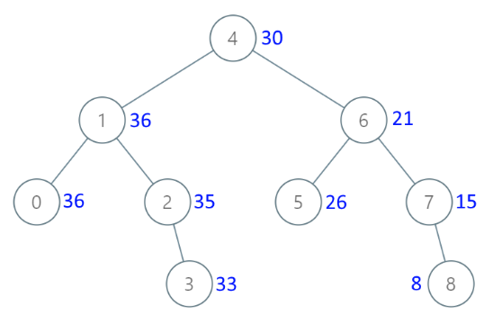



# Leetcode Problems

### 438. 找到字符串中所有字母异位词

<https://leetcode.cn/problems/find-all-anagrams-in-a-string>

给定两个字符串 s 和 p，找到 s 中所有 p 的 异位词 的子串，返回这些子串的起始索引。不考虑答案输出的顺序。

异位词 指由相同字母重排列形成的字符串（包括相同的字符串）。

*题解*

经典滑动窗口问题。 这里先放个官方题解：

```cpp
class Solution {
public:
    vector<int> findAnagrams(string s, string p) {
        int sLen = s.size(), pLen = p.size();

        if (sLen < pLen) {
            return vector<int>();
        }

        vector<int> ans;
        vector<int> sCount(26);
        vector<int> pCount(26);
        for (int i = 0; i < pLen; ++i) {
            ++sCount[s[i] - 'a'];
            ++pCount[p[i] - 'a'];
        }

        if (sCount == pCount) {
            ans.emplace_back(0);
        }

        for (int i = 0; i < sLen - pLen; ++i) {
            --sCount[s[i] - 'a'];
            ++sCount[s[i + pLen] - 'a'];

            if (sCount == pCount) {
                ans.emplace_back(i + 1);
            }
        }

        return ans;
    }
};
```

其中`sCount`就表示在s上滑动窗口中字符串的情况，每次滑动一个去和p比较即可。当然这里的比较方法和滑动都比较原始。

> 官方题解还有一个去统计`differ`而不用维持两个数组的方法，这里没有再说了。

再来看我的，我最开始没想到什么滑动窗口，所以是直接写的。（但思想和滑动窗口一样）

但我和官解最不同的在于，我添加了快速滑动。主要思想也比较简单，就是不要一个一个去滑了，比如检测到一个不在p中的k字符，那么直接可以从k之后再开始比较。还有就是如果是在窗口内检测到字符m虽然在p内，但多了，那么再开始滑动从第一个m开始，并且重新计算统计状态。

当然这里的代码写得很烂，这么多变量非常容易出错。可以只做检测到不同的快速滑动，其他的干脆就让他重新统计，这样虽然会牺牲一些性能，但简单很多。

```cpp
class Solution {
public:
    vector<int> findAnagrams(string s, string p) {
        vector<int> ret;
        if(s.size() < p.size())
            return ret;
        // unordered_map<char, int> need, window;
        int need[26], window[26];
        memset(need, 0, sizeof(need));
        for (char c : p) {
            need[c - 'a']++;
        }
        // window = need;
        memcpy(window, need, sizeof(need));
        bool continueFlag = false;
        int j = -1;
        int count = 0;
        for(int i = 0; i < s.size();i++){
            if(need[s[i]-'a'] == 0){
                continue;
            }
            if(!continueFlag){
                j = i;
                count = 0;
            }
            continueFlag = false;
            for(; j < i + p.size(); j++){
                // not found
                if(need[s[j] - 'a'] == 0){
                    i = j;
                    memcpy(window, need, sizeof(need));
                    break;
                }
                // repeated character exceed the need
                if(window[s[j] - 'a'] == 0){
                    while(s[i] != s[j]){ 
                        window[s[i] - 'a']++;
                        i++; 
                        count--;
                    }
                    continueFlag = true;
                    j++;
                    // cur_start = i;
                    break;
                }
                window[s[j] - 'a']--;
                count++;
            }
            // using separate count var to avoid corner case which the j is the last character in continueFlag=true
            // if(j == i + p.size()){
            //     ret.push_back(i);
            //     window = need;
            // }
            if(count == p.size()){
                ret.push_back(i);
                continueFlag = true;
                window[s[i] - 'a']++;
                count--;
            }
        }
        return ret;
    }
};
```

### 448. 找到所有数组中消失的数字

<https://leetcode.cn/problems/find-all-numbers-disappeared-in-an-array>

给你一个含 n 个整数的数组 nums ，其中 nums[i] 在区间 [1, n] 内。请你找出所有在 [1, n] 范围内但没有出现在 nums 中的数字，并以数组的形式返回结果。

*题解*

```cpp
class Solution {
public:
    vector<int> findDisappearedNumbers(vector<int>& nums) {
        for(int i = 0;i < nums.size();i++){
            if(nums[i] == 0)
                continue;
            int j = nums[i] - 1;
            while(nums[j] != 0){
                int tmp = nums[j];
                nums[j] = 0;
                j = tmp - 1;
            }
        }
        vector<int> ret;
        ret.reserve(nums.size() / 2);
        for(int i = 0;i < nums.size();i++){
            if(nums[i] != 0){
                ret.push_back(i+1);
            }
        }
        return ret;
    }
};
```

主要是要想到利用原地数组作为hash数组。对于复用原地数组的一个较好的方案不是想我这里去改成0，然后循环处理，而是可以存成负值。

### 461. 汉明距离

<https://leetcode.cn/problems/hamming-distance>

两个整数之间的 汉明距离 指的是这两个数字对应二进制位不同的位置的数目。

给你两个整数 x 和 y，计算并返回它们之间的汉明距离。

*题解*

```cpp
class Solution {
public:
    int hammingDistance(int x, int y) {
        x = x ^ y;
        int count = 0;
        while(x){
            count += x & 1;
            x = x >> 1;
        }
        return count;
    }
};
```

异或加移位统计即可。

### 1400. 构造 K 个回文字符串

<https://leetcode.cn/problems/construct-k-palindrome-strings>

给你一个字符串 s 和一个整数 k 。请你用 s 字符串中 所有字符 构造 k 个非空 回文串 。

如果你可以用 s 中所有字符构造 k 个回文字符串，那么请你返回 True ，否则返回 False 。

*题目*

这道题的解法比较巧，没想到就没想到。主要利用回文字符串的性质。

先统计s中每个字符的次数，奇数次数的，多出来的那个必须作为回文字符串的中心。

设`r = k - odd`，即题目的k减去其中的奇数字符：

1. `r == 0`，刚好k个中心，还有剩余的偶数次字符可以随便附加到某个中心上
2. `r < 0`，奇数次数比k多，使用s的全部字符至少会得到比k多的回文串，不满足要求
3. `r > 0`，也返回true

对于第三点，由于`s >= k`，去掉小于k个奇数中心后，剩下的`s-k+r >= r`且是偶数（因为奇数全部用了）

当`r`是偶数时，从`s-k+r`中取`r`个中心，还剩偶数个字符随意附加。

当`r`是奇数时，从`s-k+r`中取`r-1`中心，还剩偶数，直接构成剩余的。

所以均成立。

### 215. 数组中的第K个最大元素

<https://leetcode.cn/problems/kth-largest-element-in-an-array>

给定整数数组 nums 和整数 k，请返回数组中第 k 个最大的元素。

请注意，你需要找的是数组排序后的第 k 个最大的元素，而不是第 k 个不同的元素。

你必须设计并实现时间复杂度为 O(n) 的算法解决此问题。

*题解*

快速选择没啥好说的。

```cpp
class Solution {
public:
    int ik;
    int ret;
    int findKthLargest(vector<int>& nums, int k) {
        ik = nums.size() - k;
        _findKth(nums, 0, nums.size() - 1);
        return ret;
    }

    void _findKth(vector<int>& nums, int s, int e){
        int pivot = nums[s];
        int i = s, j = e;
        while(i < j){
            while(nums[j] >= pivot && i < j) j--;
            nums[i] = nums[j];
            while(nums[i] <= pivot && i < j) i++;
            nums[j] = nums[i];
        }

        nums[i] = pivot;

        if(i < ik){
            _findKth(nums, i + 1, e);
        }else if(i > ik){
            _findKth(nums, s, i - 1);
        }else{
            ret = nums[i];
        }
    }
};
```

但似乎测试用例中有一个非常奇怪的用例，如果选择`nums[s]`为pivot会导致时间复杂度退化，导致非常耗时。

所以，可以其他的pivot选择策略，比如三值取中。

### 27. 移除元素

<https://leetcode.cn/problems/remove-element>

给你一个数组 nums 和一个值 val，你需要 原地 移除所有数值等于 val 的元素，并返回移除后数组的新长度。

不要使用额外的数组空间，你必须仅使用 O(1) 额外空间并 原地 修改输入数组。

元素的顺序可以改变。你不需要考虑数组中超出新长度后面的元素。

*题目*

由于元素顺序可以改变，所以可以很快，直接用尾部的去填写就可以了。

```cpp
class Solution {
public:
    int removeElement(vector<int>& nums, int val) {
        int tail = nums.size() - 1;
        for(int i = 0; i < nums.size() && i <= tail; i++){
            if(nums[i] == val){
                while(nums[tail] == val && tail > i){
                    tail--;
                }
                nums[i] = nums[tail--];
            }
        }
        return tail + 1;
    }
};
```

### 26. 删除有序数组中的重复项

<https://leetcode.cn/problems/remove-duplicates-from-sorted-array>

给你一个 非严格递增排列 的数组 nums ，请你 原地 删除重复出现的元素，使每个元素 只出现一次 ，返回删除后数组的新长度。元素的 相对顺序 应该保持 一致 。然后返回 nums 中唯一元素的个数。

考虑 nums 的唯一元素的数量为 k ，你需要做以下事情确保你的题解可以被通过：

更改数组 nums ，使 nums 的前 k 个元素包含唯一元素，并按照它们最初在 nums 中出现的顺序排列。nums 的其余元素与 nums 的大小不重要。
返回 k

*题解*

注意到数组本身是排序的，所以就很简单了。

```cpp
class Solution {
public:
    int removeDuplicates(vector<int>& nums) {
        int val = nums[0], head = 1;
        for(int i = 1; i < nums.size(); i++){
            if(nums[i] != val){
                nums[head++] = nums[i];
                val = nums[i];
            }
        }
        return head;
    }
};
```

### 80. 删除有序数组中的重复项 II

<https://leetcode.cn/problems/remove-duplicates-from-sorted-array-ii>

给你一个有序数组 nums ，请你 原地 删除重复出现的元素，使得出现次数超过两次的元素只出现两次 ，返回删除后数组的新长度。

不要使用额外的数组空间，你必须在 原地 修改输入数组 并在使用 O(1) 额外空间的条件下完成。

*题解*

才做完上一题，解法完全相同。

```cpp
class Solution {
public:
    int removeDuplicates(vector<int>& nums) {
        int val = nums[0], head = 1;
        if(nums.size() > 1 && val == nums[1]){
            head++;
        }
        for(int i = head; i < nums.size(); i++){
            if(nums[i] != val){
                nums[head++] = nums[i];
                val = nums[i];
                if(i+1 < nums.size() && nums[i+1] == val){
                    nums[head++] = nums[i];
                }
            }
        }
        return head;
    }
};
```

### 189. 轮转数组

<https://leetcode.cn/problems/rotate-array>

给定一个整数数组 nums，将数组中的元素向右轮转 k 个位置，其中 k 是非负数。

*题解*

看似很简单，如果要求使用原地数组，且时间复杂度为O(n)则显得麻烦。

这里使用三段反转的方式。向右移动`k`则和`k mod n`是一样的，故一定是`k mod n`个末尾字段到了数组头，数组前面的到了数组尾部。

```cpp
class Solution {
public:
    void rotate(vector<int>& nums, int k) {
        int real_k = k % nums.size();
        if(real_k == 0) return;
        reverse(nums.begin(), nums.end());
        reverse(nums.begin(), nums.begin() + real_k);
        reverse(nums.begin() + real_k, nums.end());
    }
};
```

到这里都很简单。但还有一种循环替代法，这种也是比较直观的做法。

但证明非常麻烦

> 没证出来:(

假设从`nums[0]`开始直接往最终位置放，放了之后的那个位置再往它的最终位置。

设`real_k = k mod n`，那么`nums[0]`回到自身时，一定是`real_k`和`n`的最小公倍数`s`，则有`s/real_k`表示一轮确定的数量。

`n / (s/real_k)`为需要迭代的轮次即`real_k`和`n`的最大公约数。

### 274. H 指数

<https://leetcode.cn/problems/h-index>

给你一个整数数组 citations ，其中 citations[i] 表示研究者的第 i 篇论文被引用的次数。计算并返回该研究者的 h 指数。

根据维基百科上 h 指数的定义：h 代表“高引用次数” ，一名科研人员的 h 指数 是指他（她）至少发表了 h 篇论文，并且 至少 有 h 篇论文被引用次数大于等于 h 。如果 h 有多种可能的值，h 指数 是其中最 大的那个。

*题解*

最简单的做法，即先排序再找。

```cpp
class Solution {
public:
    int hIndex(vector<int>& citations) {
        sort(citations.begin(), citations.end(), greater<int>());
        int i = 1;
        for(; i <= citations.size(); i++){
            if(citations[i-1] < i){
                break;
            }
        }
        return i - 1;
    }
};
```

官方题解中，有种方法是O(n)，即先维持一个计数器数组`counter[n]`，直接看代码。

```cpp
class Solution {
public:
    int hIndex(vector<int>& citations) {
        int n = citations.size(), tot = 0;
        vector<int> counter(n + 1);
        for (int i = 0; i < n; i++) {
            if (citations[i] >= n) {
                counter[n]++;
            } else {
                counter[citations[i]]++;
            }
        }
        for (int i = n; i >= 0; i--) {
            tot += counter[i];
            if (tot >= i) {
                return i;
            }
        }
        return 0;
    }
};
```

### 380. O(1) 时间插入、删除和获取随机元素

<https://leetcode.cn/problems/insert-delete-getrandom-o1>

实现RandomizedSet 类：

RandomizedSet() 初始化 RandomizedSet 对象
bool insert(int val) 当元素 val 不存在时，向集合中插入该项，并返回 true ；否则，返回 false 。
bool remove(int val) 当元素 val 存在时，从集合中移除该项，并返回 true ；否则，返回 false 。
int getRandom() 随机返回现有集合中的一项（测试用例保证调用此方法时集合中至少存在一个元素）。每个元素应该有 相同的概率 被返回。
你必须实现类的所有函数，并满足每个函数的 平均 时间复杂度为 O(1)

*题目*

这道题无趣得很，必须要用随机函数才行。另外这题的一些边界条件需要注意一下，比如删除的末尾的元素。

```cpp
class RandomizedSet {
public:
    unordered_map<int, int> mp;
    vector<int> vec;
    RandomizedSet(){
        srand((unsigned)time(NULL));
    }
    
    bool insert(int val) {
        if(mp.count(val)){
            return false;
        }
        vec.push_back(val);
        mp[val] = vec.size() - 1;
        return true;
    }
    
    bool remove(int val) {
        if(!mp.count(val)){
            return false;
        }
        int inx = mp[val];
        vec[inx] = vec.back();
        mp[vec[inx]] = inx;
        vec.pop_back();
        mp.erase(val);

        return true;
    }
    
    int getRandom() {
        return vec[rand()%vec.size()];
    }
};
```

### 12. 整数转罗马数字

罗马数字包含以下七种字符： I， V， X， L，C，D 和 M。

字符          数值
I             1
V             5
X             10
L             50
C             100
D             500
M             1000
例如， 罗马数字 2 写做 II ，即为两个并列的 1。12 写做 XII ，即为 X + II 。 27 写做  XXVII, 即为 XX + V + II 。

通常情况下，罗马数字中小的数字在大的数字的右边。但也存在特例，例如 4 不写做 IIII，而是 IV。数字 1 在数字 5 的左边，所表示的数等于大数 5 减小数 1 得到的数值 4 。同样地，数字 9 表示为 IX。这个特殊的规则只适用于以下六种情况：

I 可以放在 V (5) 和 X (10) 的左边，来表示 4 和 9。
X 可以放在 L (50) 和 C (100) 的左边，来表示 40 和 90。 
C 可以放在 D (500) 和 M (1000) 的左边，来表示 400 和 900。
给你一个整数，将其转为罗马数字。

*题解*

直接按照基数来就行了：

```cpp
const pair<int, string> roman_radix[] = {
    {1000, "M"}, {900, "CM"}, {500, "D"}, {400, "CD"}, {100, "C"},
    {90, "XC"},  {50, "L"},   {40, "XL"}, {10, "X"},   {9, "IX"},
    {5, "V"},    {4, "IV"},   {1, "I"}};

class Solution {
public:
    string intToRoman(int num) {
        string ret;
        int radix = 0;
        while(num > 0){
            for(;radix < 13; radix++){
                if(roman_radix[radix].first <= num)
                    break;
            }
            while(num >= roman_radix[radix].first){
                num -= roman_radix[radix].first;
                ret.insert(ret.end(), roman_radix[radix].second.begin(), roman_radix[radix].second.end());
            }
        }
        return ret;
    }
};
```

### 134.加油站

<https://leetcode.cn/problems/gas-station>

在一条环路上有 n 个加油站，其中第 i 个加油站有汽油 gas[i] 升。

你有一辆油箱容量无限的的汽车，从第 i 个加油站开往第 i+1 个加油站需要消耗汽油 cost[i] 升。你从其中的一个加油站出发，开始时油箱为空。

给定两个整数数组 gas 和 cost ，如果你可以按顺序绕环路行驶一周，则返回出发时加油站的编号，否则返回 -1 。如果存在解，则 保证 它是 唯一 的

*题解*

最容易想到的是暴力做法，从每个点出发都去模拟一下，即到达每个点时都有`gas_sum >= cost_sum`，则一定可以走到下一个位置。但时间为O(n^2)，会超时。

但可以观察到，如果从i点出发，走到j点时出现了`gas_sum < cost_sum`则无法走到j+1加油站，而由于在`i~j`之间的加油站都有`gas_sum >= cost_sum`

所以从`i+1~j`的任意加油站出发都会在j点出现`gas_sum < cost_sum`故可以直接从j+1开始下一次模拟。时间复杂度下降到O(n)

```cpp
class Solution {
public:
    int canCompleteCircuit(vector<int>& gas, vector<int>& cost) {
        int gas_sum = 0, cost_sum = 0;
        bool found = true;
        for(int i = 0;i < gas.size(); ){
            found = true;
            gas_sum = cost_sum = 0;
            for(int j = 0; j < gas.size(); j++){
                int real_j = (i + j) % gas.size();
                gas_sum += gas[real_j];
                cost_sum += cost[real_j];
                if(gas_sum < cost_sum){
                    i = i + j + 1;
                    found = false;
                    break;
                }
            }
            if(found){
                return i;
            }
        }
        return -1;
    }
};
```

### 58.最后一个单词的长度

<https://leetcode.cn/problems/length-of-last-word>

给你一个字符串 s，由若干单词组成，单词前后用一些空格字符隔开。返回字符串中 最后一个 单词的长度。

单词 是指仅由字母组成、不包含任何空格字符的最大
子字符串
子字符串
子字符串 是字符串中连续的字符序列。

*题解*

简单题，注意边界条件。

```cpp

class Solution {
public:
  int lengthOfLastWord(string s) {
    int end = -1;
    for (int i = s.size() - 1; i >= 0; i--) {
        if(s[i] != ' '){
            end = i;
            break;
        }
    }
    for(int i = end - 1;i >= 0;i--){
        if(s[i] == ' ')
            return end - i;
    }
    return end + 1;
  }
};
```

### 28. 找出字符串中第一个匹配项的下标

<https://leetcode.cn/problems/find-the-index-of-the-first-occurrence-in-a-string>

给你两个字符串 haystack 和 needle ，请你在 haystack 字符串中找出 needle 字符串的第一个匹配项的下标（下标从 0 开始）。如果 needle 不是 haystack 的一部分，则返回  -1 。

*题目*

最优做法应该是使用KMP算法。

```cpp
class Solution {
 public:
  int strStr(string haystack, string needle) {
    int i = 0, j = 0;
    vector<int> next;
    calcNext(next, needle);
    while(i < (int)haystack.size() && j < (int)needle.size()){
      if(j == -1 || haystack[i] == needle[j]){
        i++;
        j++;
      }else{
        j = next[j];
      }
    }
    if(j == needle.size()){
      return i - j;
    }
    return -1;
  }

  void calcNext(vector<int> &next, string &str) {
    if (next.size() != str.size()) {
      next.resize(str.size());
    }
    next[0] = -1;
    int j = 1, k = -1;
    while (j < str.size()) {
      if (k == -1 || str[j - 1] == str[k]) {
        next[j++] = ++k;
      } else {
        k = next[k];
      }
    }
  }
};
```

经典KMP实现。注意`-1 < (size_t)0`竟然是`false`，`int`被提升为了无符号的`size_t`而不是反过来。

字符串匹配其实可以认为是比较经典的滑动窗口问题，滑动窗口的优化一般都是一次性可以多滑动一点，而不是+1.

KMP的方案就是通过当某个字符匹配失败时，根据已知的信息确定一个最大滑动距离。

这里最大滑动距离通过next数组来提供，`next[i]`含义是在`needle[0, i]`中不包含`needle[i]`时，从后往前匹配`needle`从前往后中的最大匹配长度。

### 68.文本左右对齐

<https://leetcode.cn/problems/text-justification>

给定一个单词数组 words 和一个长度 maxWidth ，重新排版单词，使其成为每行恰好有 maxWidth 个字符，且左右两端对齐的文本。

你应该使用 “贪心算法” 来放置给定的单词；也就是说，尽可能多地往每行中放置单词。必要时可用空格 ' ' 填充，使得每行恰好有 maxWidth 个字符。

要求尽可能均匀分配单词间的空格数量。如果某一行单词间的空格不能均匀分配，则左侧放置的空格数要多于右侧的空格数。

文本的最后一行应为左对齐，且单词之间不插入额外的空格。

*题解*

这题远远算不上难题吧。

```cpp
class Solution {
 public:
  vector<string> fullJustify(vector<string>& words, int maxWidth) {
    vector<string> ret;
    int i = 0, j = 0, n = words.size();
    while (i < n) {
      ret.push_back("");
      string& line = ret.back();
      line.reserve(maxWidth + 1);
      int line_len = words[i].size();
      int real_char_num = words[i].size();
      for (j = i + 1; j < n; j++) {
        line_len += words[j].size() + 1;
        if (line_len > maxWidth) {
          break;
        }
        real_char_num += words[j].size();
      }

      // last line, left justify
      if (j == n) {
        append_str(line, words[i]);
        for (int s = i + 1; s < j; s++) {
          line.push_back(' ');
          append_str(line, words[s]);
        }
        if (line.size() < maxWidth) {
          append_space(line, maxWidth - line.size());
        }
        break;
      }

      // only one word
      if (j - i == 1) {
        append_str(line, words[i]);
        append_space(line, maxWidth - line.size());
        i = j;
        continue;
      }

      int evenly_space_num = (maxWidth - real_char_num) / (j - i - 1);
      int remain = (maxWidth - real_char_num) % (j - i - 1);
      append_str(line, words[i]);
      for (int s = i + 1; s < j; s++) {
        append_space(line, evenly_space_num);
        if(remain > 0){
          append_space(line, 1);
          remain--;
        }
        append_str(line, words[s]);
      }
      i = j;
    }
    return ret;
  }

  void append_str(string& dst, string& str) {
    dst.insert(dst.end(), str.begin(), str.end());
  }

  void append_space(string& dst, int num) {
    for (int i = 0; i < num; i++) {
      dst.push_back(' ');
    }
  }
};
```

### 167.两数之和 II - 输入有序数组

<https://leetcode.cn/problems/two-sum-ii-input-array-is-sorted>

给你一个下标从 1 开始的整数数组 numbers ，该数组已按 非递减顺序排列  ，请你从数组中找出满足相加之和等于目标数 target 的两个数。如果设这两个数分别是 numbers[index1] 和 numbers[index2] ，则 1 <= index1 < index2 <= numbers.length 。

以长度为 2 的整数数组 [index1, index2] 的形式返回这两个整数的下标 index1 和 index2。

你可以假设每个输入 只对应唯一的答案 ，而且你 不可以 重复使用相同的元素。

你所设计的解决方案必须只使用常量级的额外空间。

*题解*

能明显感觉到该题是被精心设计的。

序列是非严格递增的，而两数之和一定是一大一小（或者相等），所以可以想到双指针遍历。

而从左边确定一个`nums[i]`后，从右边往下找`tmp = target - nums[i]`即可，如果没找到则得到一个`nums[j] < tmp`，而`nums[i+1]`又更大，相比`nums[i]`的`tmp`，此时他的`tmp`一定更小，正好可以从`j`开始继续找，因为刚才找的大于`j`的有`nums[] > tmp1 > tmp2`

直接看代码：

```cpp
class Solution {
 public:
  vector<int> twoSum(vector<int>& numbers, int target) {
    int i = 0, j = numbers.size() - 1;
    while (i < j) {
      int tmp = target - numbers[i];
      while(numbers[j] > tmp) j--;
      if(numbers[j] == tmp){
        return {i+1, j+1};
      }
      i++;
    }
    return {-1, -1};
  }
};
```

### 125.验证回文串

<https://leetcode.cn/problems/valid-palindrome>

如果在将所有大写字符转换为小写字符、并移除所有非字母数字字符之后，短语正着读和反着读都一样。则可以认为该短语是一个 回文串 。

字母和数字都属于字母数字字符。

给你一个字符串 s，如果它是 回文串 ，返回 true ；否则，返回 false 。

*题解*

```cpp
class Solution {
 public:
  bool isPalindrome(string s) {
    int n = s.size();
    int j = n - 1, i = 0;
    while(i <= j){
      while(i < j && !is_ad(s[i])) i++;
      while(j >= i && !is_ad(s[j])) j--;
      if(i > j) break;
      if(!ad_equal(s[i], s[j])){
        return false;
      }
      j--;
      i++;
    }
    return true;
  }

  static inline bool ad_equal(char a, char b){
    if(a == b)
      return true;
    if(is_alpha(a) && is_alpha(b))
      return abs(a - b) == abs('a' - 'A');
    return false;
  }

  static inline bool is_digit(char c){
    return c >= '0' && c <= '9';
  }

  static inline bool is_alpha(char c){
    return (c >= 'a' && c <= 'z') || (c >= 'A' && c <= 'Z');
  }

  static inline bool is_ad(char c){
    return is_digit(c) || is_alpha(c);
  }
};
```

### 209.长度最小的子数组

<https://leetcode.cn/problems/minimum-size-subarray-sum>

给定一个含有 n 个正整数的数组和一个正整数 target 。

找出该数组中满足其总和大于等于 target 的长度最小的 连续
子数组
 [numsl, numsl+1, ..., numsr-1, numsr] ，并返回其长度。如果不存在符合条件的子数组，返回 0 。

*题解*

类似滑动窗口，但不一样。还是双指针，设`i=0`，然后找到第一个`nums[i, j]`的和大于等于`target`，之后在增大`j`，检查`i`是否也可增大，

通俗来说其实是找以某个`nums[i]`为末尾时，大于等于`target`的最小长度。

```cpp
class Solution {
 public:
  int minSubArrayLen(int target, vector<int>& nums) {
    int i = 0, j = 0;
    long long sum = 0;
    int min_len = INT_MAX;
    for (; j < nums.size(); j++) {
      sum += nums[j];
      if (sum < target) continue;
      while (sum - nums[i] >= target) {
        sum -= nums[i];
        i++;
      }
      if (j - i + 1 < min_len) min_len = j - i + 1;
    }
    return min_len < INT_MAX? min_len : 0;
  }
};
```

### 30.串联所有单词的子串

<https://leetcode.cn/problems/substring-with-concatenation-of-all-words>

给定一个字符串 s 和一个字符串数组 words。 words 中所有字符串 长度相同。

 s 中的 串联子串 是指一个包含  words 中所有字符串以任意顺序排列连接起来的子串。

例如，如果 words = ["ab","cd","ef"]， 那么 "abcdef"， "abefcd"，"cdabef"， "cdefab"，"efabcd"， 和 "efcdab" 都是串联子串。 "acdbef" 不是串联子串，因为他不是任何 words 排列的连接。
返回所有串联子串在 s 中的开始索引。你可以以 任意顺序 返回答案。

*题解*

这题也很容易想到滑动窗口。

所以暴力解法就是每次滑动一个字符即可。但这样每次都必须清空之前窗口的统计信息，无法利用单词信息。

所以干脆以单词长度为滑动单位，此时需要改变一下滑动方式，分别以`0~n-1`为起始点（n为一个单词的长度），以单词长度滑动。这样和一个字符一个字符滑动遍历到的窗口是一样的多的，只是换了个顺序，使其可以利用单词信息。

代码如下：

```cpp
class Solution {
public:
    vector<int> findSubstring(string s, vector<string>& words) {
        unordered_map<string, int> wordCount;
        for(auto& w : words){
            wordCount[w]++;
        }
        int wordLen = words[0].size();
        int windowSize = words.size()*wordLen;
        if(s.size() < windowSize){
            return {};
        }

        vector<int> ans;
        unordered_map<string, int> wordCountInWindow;
        int i, j;
        for(int first = 0; first < wordLen; first++){
            i = j = first;
            wordCountInWindow = wordCount;
            while(j < s.size() && i < s.size()){
                for(;j < i + windowSize; j += wordLen){
                    string word = s.substr(j, wordLen);
                    if(wordCountInWindow.count(word) == 0){
                        wordCountInWindow = wordCount;
                        i = j + wordLen;
                        j = i;
                        break;
                    }
                    wordCountInWindow[word]--;
                    if(wordCountInWindow[word] < 0){
                        while(true){
                            string old_word = s.substr(i, wordLen);
                            wordCountInWindow[old_word]++;
                            i += wordLen;
                            if(old_word == word){
                                break;
                            }
                        }
                        j += wordLen;
                        break;
                    }
                }
                if(j >= i + windowSize){
                    ans.push_back(i);
                    string old_word = s.substr(i, wordLen);
                    wordCountInWindow[old_word]++;
                    i += wordLen;
                }
            }
        }
        return ans;
    }
};
```

### 289.生命游戏

<https://leetcode.cn/problems/game-of-life>

根据 百度百科 ， 生命游戏 ，简称为 生命 ，是英国数学家约翰·何顿·康威在 1970 年发明的细胞自动机。

给定一个包含 m × n 个格子的面板，每一个格子都可以看成是一个细胞。每个细胞都具有一个初始状态： 1 即为 活细胞 （live），或 0 即为 死细胞 （dead）。每个细胞与其八个相邻位置（水平，垂直，对角线）的细胞都遵循以下四条生存定律：

1. 如果活细胞周围八个位置的活细胞数少于两个，则该位置活细胞死亡；
2. 如果活细胞周围八个位置有两个或三个活细胞，则该位置活细胞仍然存活；
3. 如果活细胞周围八个位置有超过三个活细胞，则该位置活细胞死亡；
4. 如果死细胞周围正好有三个活细胞，则该位置死细胞复活；

下一个状态是通过将上述规则同时应用于当前状态下的每个细胞所形成的，其中细胞的出生和死亡是同时发生的。给你 m x n 网格面板 board 的当前状态，返回下一个状态。

进阶：

* 你可以使用原地算法解决本题吗？请注意，面板上所有格子需要同时被更新：你不能先更新某些格子，然后使用它们的更新后的值再更新其他格子。
* 本题中，我们使用二维数组来表示面板。原则上，面板是无限的，但当活细胞侵占了面板边界时会造成问题。你将如何解决这些问题？

*题解*

题目本身比较简单，如果需要使用使用原地数组的方式，则需要引入额外的状态标记已改变的状态。（即通过该状态可以推测出原来的状态，也可以推测出新状态）。

这里我使用`-1`表示`0 -> 1`， `-2: 1 -> 0`。

代码如下：

```cpp
class Solution {
 public:
  void gameOfLife(vector<vector<int>>& board) {
    int row, col;
    row = board.size();
    col = board[0].size();

    for (int i = 0; i < row; i++) {
      for (int j = 0; j < col; j++) {
        int num = cellNum(board, i, j);
        if (board[i][j] == 1) {
          if (num < 2 || num > 3) {
            board[i][j] = -2;
          }
        } else if (num == 3) {
          board[i][j] = -1;
        }
        // printf("(%d, %d) %d, ", i, j, num);
      }
      // printf("\n");
    }

    for (int i = 0; i < row; i++) {
      for (int j = 0; j < col; j++) {
        if (board[i][j] == -1) {
          board[i][j] = 1;
        } else if (board[i][j] == -2) {
          board[i][j] = 0;
        }
      }
    }
  }

  static inline int cellNum(vector<vector<int>>& board, int center_i,
                            int center_j) {
    int now_i, now_j, row, col;
    row = board.size();
    col = board[0].size();
    int ans = 0;
    for (int i = 0; i < 3; i++) {
      for (int j = 0; j < 3; j++) {
        if (i == 1 && i == j) {
          continue;
        }
        now_i = center_i - 1 + i;
        now_j = center_j - 1 + j;
        if (now_i < 0 || now_j < 0 || now_i >= row || now_j >= col) {
          continue;
        }
        int tmp = board[now_i][now_j];
        if (tmp < 0) {
          tmp = tmp == -2 ? 1 : 0;
        }
        ans += tmp;
      }
    }
    return ans;
  }
};
```

### 205. 同构字符串

给定两个字符串 s 和 t ，判断它们是否是同构的。

如果 s 中的字符可以按某种映射关系替换得到 t ，那么这两个字符串是同构的。

每个出现的字符都应当映射到另一个字符，同时不改变字符的顺序。不同字符不能映射到同一个字符上，相同字符只能映射到同一个字符上，字符可以映射到自己本身。

*题解*

```cpp
class Solution {
 public:
  bool isIsomorphic(string s, string t) {
    unordered_map<char, char> replace_map;
    unordered_set<char> used_chars;
    for (int i = 0; i < s.size(); i++) {
      if (replace_map.count(s[i]) == 0) {
        if(used_chars.count(t[i]))
          return false;
        replace_map[s[i]] = t[i];
        used_chars.insert(t[i]);
        continue;
      }
      if (replace_map[s[i]] != t[i]) return false;
    }
    return true;
  }
};
```

其他没啥，有个小语法问题:

```cpp
int a[26] {0}; // 则全初始化为0
int a[26] {1}; // 只有第一个元素为1，其他为0
```

### 538. 把二叉搜索树转换为累加树

<https://leetcode.cn/problems/convert-bst-to-greater-tree/>

给出二叉 搜索 树的根节点，该树的节点值各不相同，请你将其转换为累加树（Greater Sum Tree），使每个节点 node 的新值等于原树中大于或等于 node.val 的值之和。

提醒一下，二叉搜索树满足下列约束条件：

节点的左子树仅包含键 小于 节点键的节点。
节点的右子树仅包含键 大于 节点键的节点。
左右子树也必须是二叉搜索树。
注意：本题和 1038: https://leetcode-cn.com/problems/binary-search-tree-to-greater-sum-tree/ 相同

*题目*

最简单的做法就是反序中序遍历，代码如下所示：

```cpp
class Solution {
 public:
  TreeNode* convertBST(TreeNode* root) {
    treeSum(root, 0);
    return root;
  }

  int treeSum(TreeNode* root, int father_sum){
    if(!root){
      return 0;
    }
    int ans = root->val;
    root->val += father_sum;
    int right_sum = treeSum(root->right, father_sum);
    ans += right_sum;
    root->val += right_sum;
    return ans + treeSum(root->left, root->val);
  }
};
```

> 这里把father_sum变成一个全局变量，可能还要更方便一点。

有一点需要注意，当在计算类似图中节点2时，其的和除了自己，自己左子树的和，还有节点4（根）的和。



除此之外，官方题解中还提到了Morris遍历，即借用类似线索二叉树遍历的方式（用最左节点的空指针），避免使用额外的空间，空间复杂度只需O(1)。

这里附上代码：

```cpp
class Solution {
public:
    TreeNode* getSuccessor(TreeNode* node) {
        TreeNode* succ = node->right;
        while (succ->left != nullptr && succ->left != node) {
            succ = succ->left;
        }
        return succ;
    }

    TreeNode* convertBST(TreeNode* root) {
        int sum = 0;
        TreeNode* node = root;

        while (node != nullptr) {
            if (node->right == nullptr) {
                sum += node->val;
                node->val = sum;
                node = node->left;
            } else {
                TreeNode* succ = getSuccessor(node);
                if (succ->left == nullptr) {
                    succ->left = node;
                    node = node->right;
                } else {
                    succ->left = nullptr;
                    sum += node->val;
                    node->val = sum;
                    node = node->left;
                }
            }
        }

        return root;
    }
};
```

### 543.二叉树的直径

给你一棵二叉树的根节点，返回该树的 直径 。

二叉树的 直径 是指树中任意两个节点之间最长路径的 长度 。这条路径可能经过也可能不经过根节点 root 。

两节点之间路径的 长度 由它们之间边数表示。

*题解*

考虑每个节点，假设最长直径就是以它为转折，那么此时该路径长度为，左子树的高度加上右子树的高度。

总有一种方案是最优的，所以比较所有节点的值，取最大的即可。


```cpp
class Solution {
 public:
  int ans = 0;
  int diameterOfBinaryTree(TreeNode* root) {
    treeHeight(root);
    return ans;
  }

  int treeHeight(TreeNode* root){
    if(!root)
      return -1;
    int left_h = treeHeight(root->left);
    int right_h = treeHeight(root->right);
    ans = max(ans, left_h + right_h + 2);
    return 1 + max(left_h, right_h);
  }
};
```

### 560.和为K的子数组

<https://leetcode.cn/problems/subarray-sum-equals-k/description/>

给你一个整数数组 nums 和一个整数 k ，请你统计并返回 该数组中和为 k 的子数组的个数 。

子数组是数组中元素的连续非空序列。

*题目*

暴力可解：

```cpp
class Solution {
 public:
  int subarraySum(vector<int>& nums, int k) {
    int sum = 0, n = nums.size();
    int ans = 0;
    for(int i = 0;i < n; i++){
      sum = 0;
      for(int j = i; j < n; j++){
        sum += nums[j];
        if(sum == k)
          ans++;
      }
    }
    return ans;
  }
};
```

优化为`O(n)`，使用前缀和hash map，`pre[j] - pre[i] = k`，则`pre[j] - k = pre[i]`，故只需要把`pre[i]`用hash map统计起来，执行到`j`时再用`pre[j] - k`去查即可。

注意hash map的初始值，对于`0~j`的数组需要一个`mp[0] = 1`

```cpp
class Solution {
 public:
  int subarraySum(vector<int>& nums, int k) {
    unordered_map<int, int> mp;
    int sum = 0;
    int ans = 0;
    for(int i = 0; i < nums.size(); i++){
      sum += nums[i];
      if(mp.count(sum - k)){
        ans += mp[sum - k];
      }
      mp[sum]++;
    }
    return ans;
  }
};
```

### 581. 最短无序连续子数组

<https://leetcode.cn/problems/shortest-unsorted-continuous-subarray/description/>

给你一个整数数组 nums ，你需要找出一个 连续子数组 ，如果对这个子数组进行升序排序，那么整个数组都会变为升序排序。

请你找出符合题意的 最短 子数组，并输出它的长度。

*题解*

最简单的办法就是将数组排序（排pair<val, inx>）,这样比较位置变化即可。但其复杂度为`O(NlogN)`

从题目易得，根据结果可以将数组分为三段，前面的升序，中间需要排序的数组，后面又是升序。

可以从排序的性质入手，从最后一个元素开始考虑设下标为`i=n-1`，那么如果`nums[i]`比之前的最大值`max_val`都大，那么`nums[i]`（即最后一个）就是在最终的位置上。

那么最后一段，都有这种性质，如果从后往前遍历，那么第一个没有这种性质的就是要求的子数组的末尾。

但由于要求`max_val`从后往前遍历不方便，从前往后遍历，那么最后一个没有这种性质的，和从后往前的第一个结果是一样的。

同理，可以根据`min_val`然后相反遍历，求出子数组的头。

代码如下：

```cpp
class Solution {
 public:
  int findUnsortedSubarray(vector<int>& nums) {
    int cur_max = INT_MIN, cur_min = INT_MAX, n = nums.size();
    int last_max_reverse_inx = -1, last_min_reverse_inx = -1;
    for(int i = 0;i  < n;i++){
      if(nums[i] < cur_max){
        last_max_reverse_inx = i;
      }else
        cur_max = nums[i];

      if(nums[n - i - 1] > cur_min){
        last_min_reverse_inx = nums.size() - i - 1;
      }else{
        cur_min = nums[n - i - 1];
      }
    }

    if(last_max_reverse_inx == -1)
      return 0;
    return last_min_reverse_inx - last_max_reverse_inx + 1;
  }
};
```

### 617.合并二叉树

给你两棵二叉树： root1 和 root2 。

想象一下，当你将其中一棵覆盖到另一棵之上时，两棵树上的一些节点将会重叠（而另一些不会）。你需要将这两棵树合并成一棵新二叉树。合并的规则是：如果两个节点重叠，那么将这两个节点的值相加作为合并后节点的新值；否则，不为 null 的节点将直接作为新二叉树的节点。

返回合并后的二叉树。

注意: 合并过程必须从两个树的根节点开始

*题解*

想到递归，这就是最简单的做法。

```cpp
class Solution {
 public:
  TreeNode* mergeTrees(TreeNode* root1, TreeNode* root2) {
    if (!root1 && !root2) return nullptr;
    if (root1 == nullptr) return root2;
    if (root2 == nullptr) return root1;
    root2->val += root1->val;
    root2->left = mergeTrees(root1->left, root2->left);
    root2->right = mergeTrees(root1->right, root2->right);
    return root2;
  }
};
```

### 621.任务调度器

给你一个用字符数组 tasks 表示的 CPU 需要执行的任务列表，用字母 A 到 Z 表示，以及一个冷却时间 n。每个周期或时间间隔允许完成一项任务。任务可以按任何顺序完成，但有一个限制：两个 相同种类 的任务之间必须有长度为 n 的冷却时间。

返回完成所有任务所需要的 最短时间间隔 。

```
示例 1：

输入：tasks = ["A","A","A","B","B","B"], n = 2
输出：8
解释：A -> B -> (待命) -> A -> B -> (待命) -> A -> B
     在本示例中，两个相同类型任务之间必须间隔长度为 n = 2 的冷却时间，而执行一个任务只需要一个单位时间，所以中间出现了（待命）状态。 
```

*题解*

采用模拟的方式，在每个时间点都去选择未处于冷却，并且剩余任务次数最多的。

具体的证明参见[leetcode官方题解](https://leetcode.cn/problems/task-scheduler/solutions/509687/ren-wu-diao-du-qi-by-leetcode-solution-ur9w/)

```cpp
class Solution {
 public:
  int leastInterval(vector<char>& tasks, int n) {
    // : {nextValidTime, freq}
    vector<pair<int, int>> freq(26, {1, 0});
    for (auto c : tasks) {
      freq[c - 'A'].second++;
    }
    int task_count = 0;
    int min_time, max_inx;
    int time_now = 1;
    while (task_count < tasks.size()) {
      max_inx = pickMaxFreq(time_now, freq, min_time);
      if (max_inx == -1) {
        time_now = min_time;
        continue;
      }
      freq[max_inx].first = time_now + n + 1;
      freq[max_inx].second--;
      task_count++;
      time_now++;
    }
    return time_now - 1;
  }

  static inline int pickMaxFreq(int now, vector<pair<int, int>>& freq,
                                int& min_time) {
    int ret = -1;
    int max_freq = 0;
    min_time = INT_MAX;
    for (int i = 0; i < freq.size(); i++) {
      if (freq[i].first <= now && freq[i].second > max_freq) {
        max_freq = freq[i].second;
        ret = i;
      }
      // ignore 0 freq task
      if (freq[i].second > 0) min_time = min(min_time, freq[i].first);
    }
    return ret;
  }
};
```

### 739. 每日温度

给定一个整数数组 temperatures ，表示每天的温度，返回一个数组 answer ，其中 answer[i] 是指对于第 i 天，下一个更高温度出现在几天后。如果气温在这之后都不会升高，请在该位置用 0 来代替。

*题解*

可通过单调递减栈来计算。比较简单直接看代码。

```cpp
class Solution {
 public:
  vector<int> dailyTemperatures(vector<int>& temperatures) {
    vector<int> ans(temperatures.size(), 0);
    stack<pair<int, int>> st;
    for(int i = temperatures.size() - 1; i >= 0; i--){
      while(!st.empty() && st.top().first <= temperatures[i]){
        st.pop();
      }
      if(!st.empty()){
        ans[i] = st.top().second - i;
      }
      st.push({temperatures[i], i});
    }
    return ans;
  }
};
```

### 11.盛水最多的容器

给定一个长度为 n 的整数数组 height 。有 n 条垂线，第 i 条线的两个端点是 (i, 0) 和 (i, height[i]) 。

找出其中的两条线，使得它们与 x 轴共同构成的容器可以容纳最多的水。

返回容器可以储存的最大水量。

说明：你不能倾斜容器。

*题解*

这道题的解法可以说相当巧妙了。双指针，每次移动高度较低那个，见代码：

```cpp
class Solution {
 public:
  int maxArea(vector<int>& height) {
    int i = 0, j = height.size() - 1;
    int ans = 0;
    while(i < j){
      ans = max((j - i) * min(height[i], height[j]), ans);
      if(height[i] < height[j]) i++;
      else j--;
    }
    return ans;
  }
};
```

正确性说明：对于最开始`(0, n-1)`，假设`height[0] < height[n-1]`，那么对于所有的包含`height[0]`容器来说，`height[0] * (n-1)`就是最大值。

> 因为此时x是最大的，并且容积是min(height[0], height[other])*x，其中`min(height[0], height[other]) <= height[0]`

所以此时`height[0]`就可以不用考虑了，移动i指针，使用同样的方法去考虑`height[1, n-1]`，依次递归考虑。

### 15. 三数之和

给你一个整数数组 nums ，判断是否存在三元组 [nums[i], nums[j], nums[k]] 满足 i != j、i != k 且 j != k ，同时还满足 nums[i] + nums[j] + nums[k] == 0 。请

你返回所有和为 0 且不重复的三元组。

注意：答案中不可以包含重复的三元组。

*题解*

这里的重点在于答案不能重复。

有两种O(n^2)的解法：

1. 从左遍历，设nums[i]为三数中的`nums[i]`，那么找出所有包含nums[i]的所有满足要求三元组(所以下一次nums[i+1]时就不用考虑nums[i]了)，此时相当于在`(i+1, n-1)`中找两数之和(用Hash表)。

2. 和1思想一样但是找两数之和的方式使用排序+双指针，即先将nums排序，还是从左遍历确定一个nums[i]，然后由于`(i+1, n-1)`现在是有序的，所以找两数之和可用双指针。
