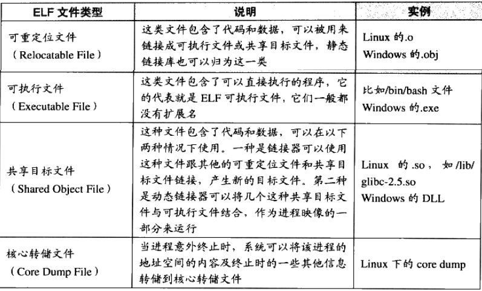

# EFL符号链接

## || 静态链接

### >> 静态链接简介

C/C++中支持模块开发（即划分为多个源文件），每个源文件将被编译为一个单独的目标文件（Obj）。

目标文件可能引用了其他目标文件中的函数和数据，在最终被链接到一起时需要处理这些引用。

在链接的过程中主要通过符号（函数名、变量名）来处理这些互相引用，其实也就是为这些引用设置好最终拼接好的最终地址。

故，编译出的目标文件中除了代码和数据的二进制信息，还包括未处理的符号信息。

如：`movl $0x2a, var`，即`var = 42`，但该`var`是其他模块定义的全局变量。

故该模块编译时无法确定`var`的地址，可编译为`c7 05 - 00 00 00 00 - 2a 00 00 00`，先不管`var`地址（这里置为0），

而是将该位置记录下来，这里需要`var`符号的地址，在链接时确定了`var`的最终地址，则将这里的0替换为实际的地址。

这种地址修正的过程称为**重定位**，修正的地方称为**重定位入口**

> 这一节中，模块和目标文件同义。

### >> 目标文件

目前，Window下使用的可执行文件格式为PE(Portable Executable)，Linux下为ELF(Executable Linkable Format)，都属于COFF（Common file Format)

而目标文件和可执行文件非常相似，从广义上看是完全相同的。在Linux下统称为ELF。

> 暂不考虑window

ELF标准中的分类：

Linux下可通过`file`指令查看文件类别。

### >> 静态链接过程

## || 动态链接
