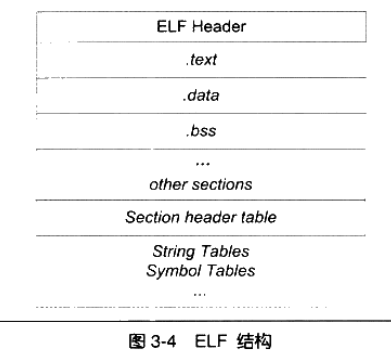

# EFL符号链接

## || 静态链接

### >> 静态链接简介

C/C++中支持模块开发（即划分为多个源文件），每个源文件将被编译为一个单独的目标文件（Obj）。

目标文件可能引用了其他目标文件中的函数和数据，在最终被链接到一起时需要处理这些引用。

在链接的过程中主要通过符号（函数名、变量名）来处理这些互相引用，其实也就是为这些引用设置好最终拼接好后的最终地址。

故，编译出的目标文件中除了代码和数据的二进制信息，还包括未处理的符号信息。（实际包含几乎出现的所有符号，毕竟其他模块可能会用该模块的符号）

如：`movl $0x2a, var`，即`var = 42`，但该`var`是其他模块定义的全局变量。

故该模块编译时无法确定`var`的地址，可编译为`c7 05 - 00 00 00 00 - 2a 00 00 00`

即先不管`var`地址（这里置为0），而是将该位置记录下来（还是记录在目标文件中），在链接时确定了`var`的最终地址后，则可以将这里的0替换为实际的地址。

这种地址修正的过程称为**重定位**，修正的地方称为**重定位入口**

> 这一节中，模块和目标文件同义。

### >> 目标文件

目前，Window下使用的可执行文件格式为PE(Portable Executable)，Linux下为ELF(Executable Linkable Format)，都属于COFF（Common file Format)

而目标文件和可执行文件非常相似，从广义上看是完全相同的。在Linux下统称为ELF。

> 暂不考虑window

ELF标准中的分类：


Linux下可通过`file`指令查看文件类别。


#### 目标文件内容概览

ELF类型的目标文件，是以段（Section）为单位组织的，如图所示。



其中每个段中可存放编译出的二进制代码(.txt)、数据(.data)、重定位入口等。

分段具有如下好处：

1. 可以分别为不同的段设置读写权限，如防止存放代码的段被修改
2. 便于共享只读的段，如同时运行一个程序的多个副本，代码段可被共享节省内存。
3. 现代CPU将代码和数据缓存分开存放，提高程序的局部性。

其中第2点是最重要的，其进一步被扩展为了后文的共享库的概念，大大节省了内存，也带来了其他好处。

ELF文件结构中使用ELF文件头和段表管理组成文件的段。

其中文件头中存放ELF版本、目标平台、入口地址、段表在文件中的偏移等信息。

故可直接通过文件头找到段表，而段表中主要存放每个段在文件中偏移、长度、属性等其他信息。

而对于具体的段，这里通过一个例子简单速览每个段的含义：

```cpp

```


### >> 静态链接过程

## || 动态链接
