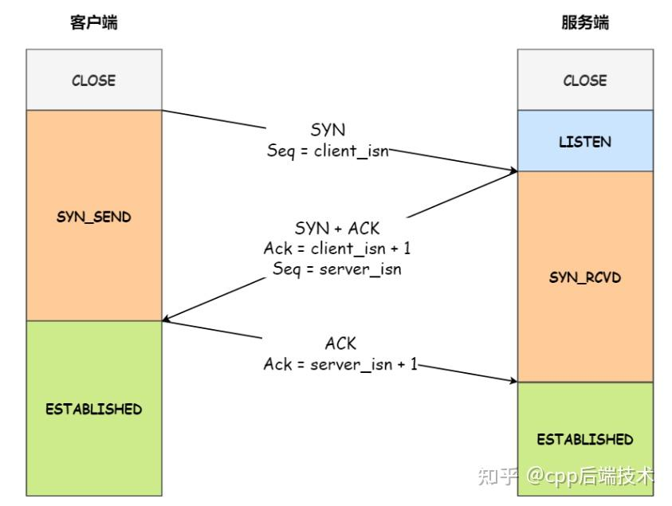
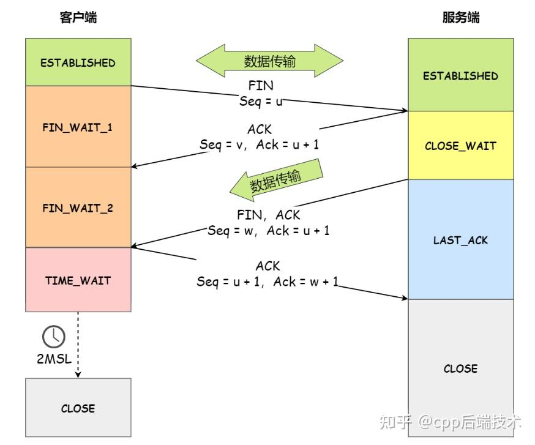

## || TCP三次握手与四次挥手

### >>> 三次握手

三次握手的最主要目的就是为了建立起全双工的连接。

具体工作：

1. 初始化Seq序列号
2. 确保双工信道正常并在双方建立需要使用的资源（缓存分配、定时器等）

三次握手的原因：

1. 确保双工信道正常。如果只两次，服务端不知道它的ACK是否正确发送到Client，即服务端无法确认到Client的信道是否OK。
2. 三次有更多的对于错误处理的空间。比如网络中的陈旧SYN请求，在服务端发送ACK后，Client可以立刻发送RST表示这是无效的连接。

### >>> 四次挥手

四次挥手是为了可靠正确的关闭TCP连接，确保所有数据都传输完毕，并且双方都释放了资源。

一次FIN+ACK的组合关闭一个方向的数据传输。另一个方向还可以传输。

最后一次等2MSL有两个作用：

1. 由于是最后一次发包（ACK），要在一定程度上确保对方收到了该ACK，从而正确释放了资源关闭了连接。所以等2MSL，对方没收到会超时重传FIN。

2. 保证网络中该连接的所有包均失效，不至于影响化身连接的传输。
