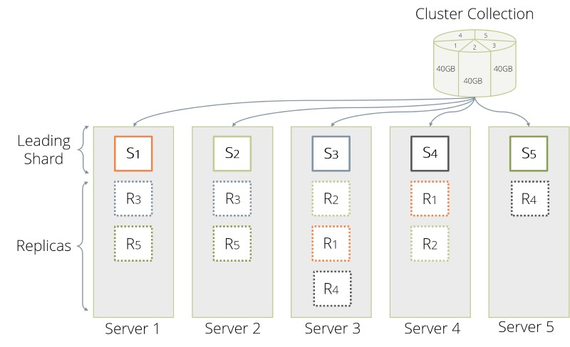
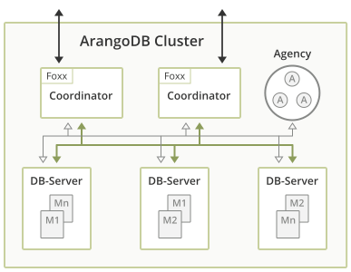

# ArangoDB

ArangoDB是一个可扩展的、高可用的图数据库系统。

说是图数据库，但其不止支持图模型，还支持文档模型和Key-Value模型。

并在其数据模型上提供丰富的查询和计算功能(使用AQL查询语言统一各模型的查询)。


本文参考自[ArangoDB v3.12文档](https://docs.arangodb.com/stable/about-arangodb/)

共分三个部分：

1. ArangoDB中组织用户数据的基础数据结构（概念）
2. 基于基础数据结构的三种数据模型：KV、Graph、Document
3. ArangoDB分布式集群架构

## [Data Structure](https://docs.arangodb.com/stable/concepts/data-structure/)

ArangoDB中将图和文档数据均存储为类Json对象。

其存储层次有三层，从低到高为：

1. Documents
2. Collections
3. Database

Documents存储在Collections中，Collections存储在Database中。

> 类比关系型数据库就是：记录、表、数据库

### Documents

ArangoDB中一条记录也叫做Document，其对应一个Json对象。

```json
{
  "_id" : "myusers/3456789",
  "_key" : "3456789",
  "_rev" : "14253647",
  "firstName" : "John",
  "lastName" : "Doe",
  "address" : {
    "street" : "Road To Nowhere 1",
    "city" : "Gotham"
  },
  "hobbies" : [
    { "name": "swimming", "howFavorite": 10 },
    { "name": "biking", "howFavorite": 6 },
    { "name": "programming", "howFavorite": 4 }
  ]
}
```

这意味着，每个Collections是Schemaless的，每条记录都一个拥有自己的Schema。

但可以为Collections设置Schema validation。

Document在ArangoDB内部存储为二进制格式-VelocyPack

> VelocyPack是自包含的、紧凑的、可直接访问成员的（不用先解析）、可快速转换为Json

#### System attribute

在Document中以下划线开头的属性为系统属性具有特殊作用。

* `_key`表示document key（primary key）

    其在Collections内唯一的标识一个document，该值可由用户指定，也可由ArangoDB自动生成，一旦设置将不在可变。

* `_id`表示document identifier
    
    即在多个Collection之间标识一个document，其一般由Collections名字和`_key`组合，由ArangoDB自动生成。

* `_rev`表示document revision

    该属性完全由ArangoDB控制，用户只具有只读权限。每当document被修改后，该值将会被修改。该特性可用于实现类似CAS的功能。（见下文事务隔离级别，ArangoDB事务不能处理丢失更新和写入偏差）

* `_from`和`_to`
    
    用于edge collection，用于指向vertex document

ArangoDB会在`_from`、`_to`、`_key`、`_id`上自动建立索引。

### Collections

Documents存在Collections中，可以在Collections上为Document建立索引。

三种类型的Collections：

1. `document collection`即普通的Collections，在图模型中也被称为`vertex collection`
2. `edge collection`，用于图模型中存储边，其中的Document具有`_from`和`_to`属性用来指向顶点Document
3. `system collection`，以下划线开头的是系统Collections，既可以是`document collection`也可以是`edge collection`

在创建Collections时可指定其类型。

#### [Sharding](https://docs.arangodb.com/stable/deploy/architecture/data-sharding/)



在分布式场景下，可在Collection-Level上进行分片（shard），并可通过`replicationFactor`指定每个Shard的副本数量。

在默认情况下，ArangoDB通过计算Document的`_key`的一致性hash来进行分片。

用户也可指定用于分区的属性。另外图模型由于存在邻近性关系，还有其他的分区方法，见下文。

而对于每个分片的副本，则采用的是主从同步复制。

ArangoDB的副本只用来做高可用，于性能只有降低没有提高（不能在副本读）。

而副本的角色即Leader还是Follwer是由另一个容错服务Agency来决定的。

> 其副本复制类似GFS，但此时的Agency是运行Raft的容错服务，见下文

##### [Transactional Isolation](https://docs.arangodb.com/3.12/develop/operational-factors/#transactional-isolation)

在单节点实例以及OneShard集群时，ArangoDB提供“可重复读”的隔离级别。

ArangoDB下层存储引擎为RocksDB，其事务特性也通过RocksDB提供的特性实现。

* 通过RocksDB的快照读，防止事务脏读以及不可重读。
* 通过RocksDB的key-level锁，防止脏写。
* 通过WAL实现事务的原子性和持久性。

但其未提供可串行的事务隔离级别，即无法防止丢失更新、写入偏差（幻读）

注意，在集群中存在分片（sharding）的情况下，无法保证"可重复读"的隔离级别。

### Database

每个Collections都是Database的一部分，`_system`Database是系统数据。

## Data Models

ArangoDB提供了三种数据模型：key-value,document,graph

### Document Model

文档模型，其实就是之前介绍的基础数据的组织方式，使用Json对象存储文档数据。

不仅可以通过之前的`_key`或者`_id`来访问Document，也可以根据文档本身子属性来进行查询，也可在这些子属性上建立索引。

### Key-Value Model

这个KV模型就很简单了，文档本身就可以存储KV，所以最简单的方法就是将`_key`的值当作Key，其他属性当作Value。

由于`_key`上有索引，所有访问速度也很快。

### [Graph Model](https://docs.arangodb.com/3.12/graphs/)

正如上文提到的，ArangoDB中组织图数据的方式是使用Document中的`_from`和`_to`系统属性。

可以在一个document collection中存储vertex的数据，然后在一个edge collection中存储边的数据。（当然，实际可以更灵活）

以这样方式组织的图数据，被称为匿名图(anonymous graphs)，可以在上面执行图操作，但图自身的一致性（如删除节点对应的边也需要删除），需要用户代码自行维护。

与之相对的是命名图(named graphs)，使用命名图相关的接口进行操作，可以保证图的一致性。

命名图的操作接口其实就是在普通Collections/Document上，增加了一层来保证图的完整性。

有四种类型的命名图：

1. General Graphs
2. Smart Graphs
3. Enterprise Graphs
4. Satellite Graphs

不同的图类型具有不同的扩展性、性能以及不同的数据分布。

> 注意：SmartGraph和EnterpriseGraph、SatelliteGraph只在Enterprise Edition ArangoDB中受支持

#### General Graphs

GeneralGraph是ArangoDB中的最基础的命名图类型无需额外配置，但只适合于小规模的图数据。

因为其数据（点和边）在整个集群中均是随机分布的，随着数据量增大，其查询性能可能变得很差。


> 应该就是对`_key`使用一致性hash来进行分区

#### Smart Graphs

许多图都有如下特征：

某个属性存在于所有的顶点中，并且可以根据该属性的值将该图划分为子图。而在子图中其自身存在大量的边，子图之间存在少量的边。

比如：

1. 社交网络图数据中，同一个国家和地区的节点。

2. 交通系统中，同一个国家和地区。

故为边和顶点的Document指定`smartGraphAttribute`，ArangoDB可以通过该属性进行分区。


#### Enterprise Graphs


EnterpriseGraph采用和GeneralGraph类似的方式来对**顶点**进行分片。

但是其保证，该点及其所有的邻接的**边**均在同一个分片（Server）存储。故不能为边Document指定分片`_key`

其和SmartGraph的区别在于，不用用户指定`smartGraphAttribute`。

#### Satellite Graphs

SatelliteGraph将图数据复制到所有的Server上。

其似乎可以和SmartGraph配合使用，在SmartGraph中某些sub-graph可以被指定为拷贝到所有分片。

## [Cluster](https://docs.arangodb.com/3.12/deploy/cluster/)

The Cluster architecture of ArangoDB is a CP master/master model with no single point of failure.

* CP指在网络分区的情况下更关注一致性而不是可用性（CAP理论）
* master/master指Client可以向任意节点发送请求，没有一个"master"
* no single point failure，单点故障时可以继续提供服务。

> 从下文的Failover来看，也算不上完全时CP，副本故障/分区，会新生成副本或者干脆不要副本继续运行。

### Structure of ArangoDB Cluster



ArangoDB集群由ArangoDB Instance组成，这些Instance通过网络通信。这些Instance可以扮演不同的角色：

* Agents
* Coordinators
* DB-Server

#### Agents

一个或者多个Agents（Instance）组成了ArangoDB集群中*Agency*

Agency其上运行Raft共识协议，是一个高可用的、弹性的KV存储，其上存储了整个集群的Configuration和数据的分布信息。

Agency在集群中处于中心地位，其他Instance可以订阅HTTP回调来获取Agency中的修改。

#### Coordinators

Coordinators是Client访问Cluster的入口。

Coordinators本身是无状态的服务，所有的Coordinators通过Agency共享数据的位置信息和集群的配置信息。

Coordinators知道数据分布的情况，故可协调各个查询任务（子任务）以及FoxxService运行的位置。

##### [Foxx Microservice](https://docs.arangodb.com/3.12/develop/foxx-microservices/)

**The Foxx framework enables you to execute JavaScript inside of ArangoDB and write custom service endpoints。**

ArangoDB allows application developers to write their data access and domain logic as microservices running directly within the database with native access to in-memory data. The Foxx microservice framework makes it easy to extend ArangoDB’s own REST API with custom HTTP endpoints using modern JavaScript running on the same V8 engine you know from Node.js and the Google Chrome web browser.

#### DB-Server

DB-Server即是实际存储分片数据的角色。

每个DB-Server上可能持有多个分片的数据。


### Automatic failover

#### Failure of a follower

当一个DB-Server挂掉时，对于其上为Follwer的Shard副本，此时Leader副本将无法执行同步复制。

Leader将在超时后（3s）执行故障转移，有一下情形：

1. A: 除了Leader所在的DB-Server，集群中还存在其他的DB-Server，将在该DB-Server上创建新的Follwer副本

2. B: 没有其他的DB-Server了，此时服务继续运行，Leader不再进行同步，此时打破了用户定义的`replicationFactor`约束

当该挂掉的DB-Server重新启动后，有如下情形：

1. 如果是A这种情况，则该DB-Server发现这里已经存在一个Follower了，故放弃其上的分片。

2. B情况，则去Leader重新同步数据。

> 感觉这种故障转移太简单了。如果一个大集群中不停的有服务器挂了又重启，将会导致分片的分布很不均匀。
> 同时Follwer副本掉了，马上生成新副本，如果一会儿旧机器就重启了，拷贝的开销太大了

#### Failure of a leader

而当一个存在Leader副本的DB-Server宕了之后，其不再发送心跳给Agency。

Agency在发现丢失心跳15s之后，从所有Follower中选择一个具有同步数据的提升为Leader。其他Follower从新Leader同步数据。

由于是主从同步复制，还需要通知Coordinators此时Configuration以发生变化，新请求导向新的Leader。

除此之外由于此时副本数量少了一个，所以同上面Failure of Follower一样，如果还有其他DB-Server存在还需要新建Follower副本。不在赘述。

## Index and Search

ArangoDB的优势除了提供多数据模型外，另一个则是多种多样的索引类型以及功能丰富的查询引擎。
