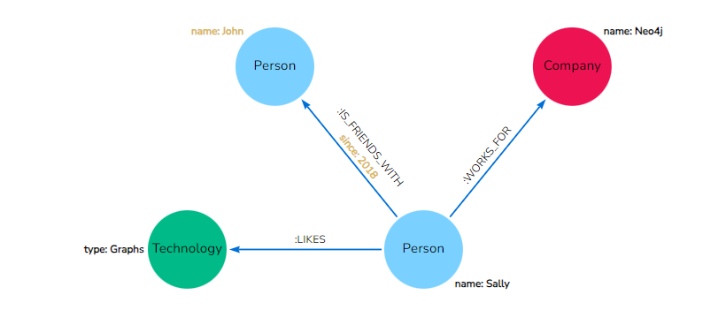

# [Query a Neo4j database using Cypher](https://neo4j.com/docs/getting-started/cypher-intro/)

> 该系列内容为Neo4j中对于Cypher的**入门介绍**。完整详细的Cypher参考见[Cypher手册](https://neo4j.com/docs/cypher-manual/current/introduction/)

## || Cypher query language

Cypher是Neo4j提出的图查询语言。

Cypher是类似SQL的声明性查询语言。同时，也是最简单的图查询语言，因为其非常符合人类直觉。

比如其语法类似如下结构：

```
(nodes)-[:ARE_CONNECTED_TO]->(otherNodes)
```

`(nodes)`圆括号表示的节点，`-[:ARROWS]->`表示的关系，形如这样的Query表示的匹配模式（Pattern）是非常容易理解，甚至可以直接按照图结构画出来。

Neo4j通过Cypher来构造高效和快速的各种图查询操作，包括创建、读、更新、删除即CRUD。

> Cypher是Neo4j提出的开源图查询语言，由于其易用性和开源属性被很多其他产品（公司）支持


## || Getting started with Cypher

### >> Why Cypher?

由节点和关系组成的Cypher Pattern，可以同时直观的表示图数据中的简单和复杂遍历和路径。

而图数据库就可根据该Pattern执行模型匹配，从而完成图操作。

所以Cypher给用户学习带来了简单性和逻辑性。


## || Cypher Syntax

### >>> Cypher comments

同大多数语言一样，`//`开头表示该行之后的内容为注释


### >>> Representing nodes in Cypher

使用圆括号括起来表示Cypher查询中的节点，如上文中的`(node)`。

在图模型中节点一般使用圆形来表示，所以这里为了一定程度上符合直觉，使用"圆括号"来标识节点。

#### Node variables

`(node)`圆括号中的`node`被称为变量，这是为了方便我们后面使用该节点，如`(person)`、`(thing)`

如果节点和查询结果不相关，则可以直接匿名节点`()`

#### Node labels

在属性图模型中，我们可以通过为节点分配相同的标签(label)来进行分组。

在Cypher中可以指定需要查询Node的Label，这使得Cypher可以区分不同的实体从而优化它的查询过程。

应该尽可能的在查询中为节点指定Label。

> 如果不指定Label将对所有的节点执行匹配，如果图数据中节点数据很多，这是显而易见的效率低下

#### Example: nodes in Cypher


```cypher
()                  //anonymous node (no label or variable) can refer to any node in the database
(p:Person)          //using variable p and label Person
(:Technology)       //no variable, label Technology
(work:Company)      //using variable work and label Company
```

### >>> Representing relationships in Cypher


在Cypher中使用`-->`和`<--`来表示两个方向的关系，除此之外还可以指定需要匹配的额外信息，如关系类型、关系属性等（如上用方括号放在中间）

使用`--`可以匹配两个方向的关系。在Neo4j中关系必须要有方向，但在查询时用户可能无法预先知道关系的方向，所以使用`--`匹配将更加灵活。

> 当`-->`或`<--`在查询时给出时，如果和实际的关系方向不一致，查询将返回空结果。

#### Relationship types

关系类型用来分类关系以及赋予关系含义，有点类似于Node Label。每个关系都必须要指定关系类型，如图中的`:IS_FRIENDS_WITH`、`:WORKS_FOR`等

你可以为节点间指定任何关系类型，但最好命名遵循`verbs and actions`的约定，这为之后的Cypher编写带来遍历，也会有更具有可读性。

#### Relationship variables

同上文的node variable一样，如果之后需要使用到查询出的关系，那么可以给他一个变量名，如`-[rel]->`或`-[rel:LIKES]->`

> `-[rel]->`由于没有指定关系类型，在匹配时将搜索所有的关系

### >>> Node or relationship properties

上文已经说明在Cypher语句中如何表示节点、关系、标签，关于属性图模型只剩下属性没有说明。

在Cypher中可以使用大括号将属性信息插入节点或者关系中，如：



* Node property: `(p:Person {name: 'Sally'})`

* Relationship property: `-[rel:IS_FRIENDS_WITH {since: 2018}]->`

### >>> Patterns in Cypher

上文所述的节点和关系的组合组合成了构建Pattern(模式)，而这些构建模式又能够组合起来表示更复杂的模式。

比如在上文的例子中，要表示`Sally likes Graphs`，可以在Cypher中用如下方式表示该Pattern:

```
(p:Person {name: "Sally"})-[rel:LIKES]->(g:Technology {type: "Graphs"})
```

但是该Cypher也只是表达出了该Pattern，并没有表达出是要查询还是插入还是删除，这需要其他关键字配合（见后文）。

在Cypher中这些模式可以连续编写，也可以使用逗号分隔开，如下：


如果要查找`What Sushi restaurants are in New York that my friends like?`，可以使用如下Cypher语句查询：

```
MATCH (person:Person {name: 'Philip'})-[:IS_FRIEND_OF]->(friend)-[:LIKES]->(restaurant:Restaurant)-[:LOCATED_IN]->(loc:Location {location: 'New York'}),
      (restaurant)-[:SERVES]->(type:Cuisine {type: 'Sushi'})
RETURN restaurant.name, count(*) AS occurrence
ORDER BY occurrence DESC
LIMIT 5
```
