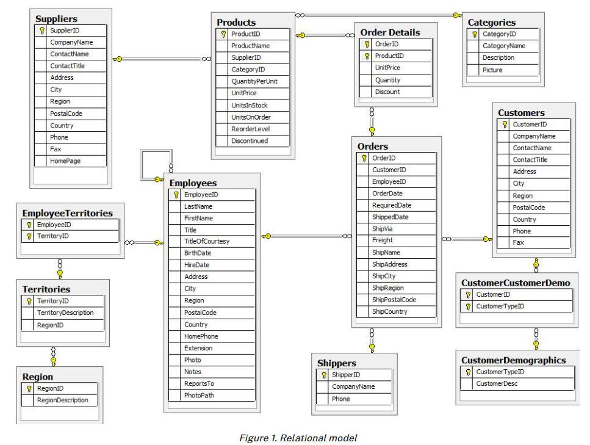
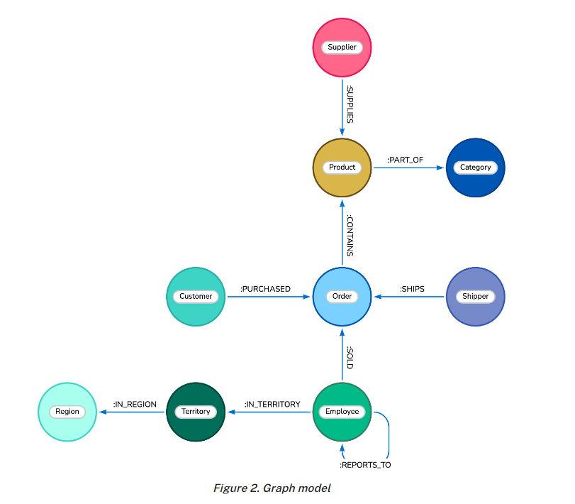
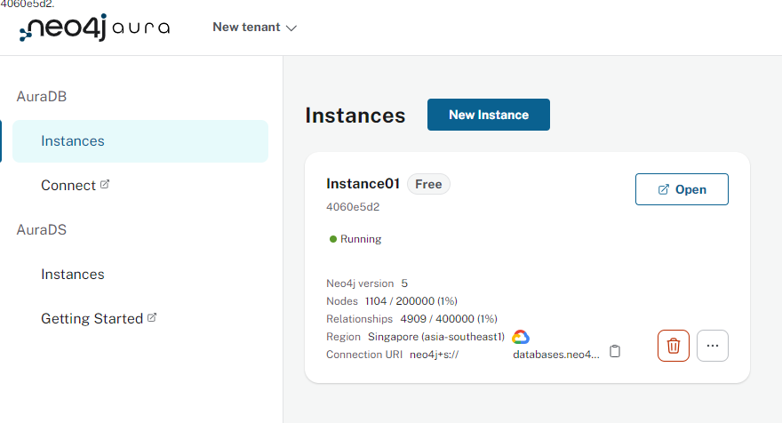
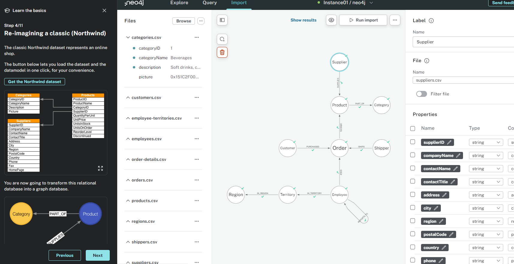

# [Comparing Cypher with SQL](https://neo4j.com/docs/getting-started/cypher-intro/cypher-sql/)

## || Introduction

本文向所有熟悉SQL的用户介绍如何理解Cypher，以及如何写出等价的Cypher。

使用`Northwind database`帮助用户理解如何将SQL翻译为Cypher，并展示两类语言的相似和不同之处。

和SQL类似，Cypher中也包含从句、关键字、表达式、算子、函数等概念。但不同于SQL，Cypher是紧紧围绕如何表达图模式(graph pattern)而设计的。

Graph Pattern是Cypher的核心，通过应用声明式的Pattern来完成对图数据的操作。

在上一篇[Query a Neo4j database using Cypher](./1-query-a-neo4j-database-using-cypher.md)已经介绍了Cypher的基础内容。

Cypher允许链式组合多个查询部分，从而产生复杂查询。你甚至可以在同一条语句中混合读操作和写操作。

还可以使用用户定义过程和函数(user-defined procedures and functions)可以扩展Cypher功能。

## || Northwind example model

`Northwind database`是一个典型零售应用程序数据库，包含products, orders, employees, shippers, and categories as well as their interactions。

如下图所示：



> 这里默认读者熟悉关系模型相关知识，不再介绍

对于一个合理的关系模型，可以很容易将其转换为图模型。

关系模型中的每个实体表中一行可以对应一个Node，实体表名还可以作为这些Node的Label。而简单外键关系和关系表转换为对应的图关系连接对应的Nodes。表中字段均可以作为节点和关系的属性存在。

转换后的图模型如下图所示：



## || Explore Cypher queries: from basic to advanced

> 以下所有操作都在[AuraDB Free instance](https://neo4j.com/cloud/aura/?ref=developer-guides)上完成。

创建完成实例后，连接该实例进入Workspace。



> 以上实例为导入Northwind后截图的

通过右上角的Neo4j Guides导入Northwind示例数据



> 再Cypher-Shell等命令行工具中通常要求Cypher语句以`;`结尾。但在Neo4j Browser or Query in Workspace，通常不加`;`也没有问题

### >>> Find all products

*Select and return record*

SQL:

```
SELECT p.*
FROM products as p;
```

对应Cypher则使用`MATCH`匹配一个简单Pattern，并将匹配结果`RETURN`

```
MATCH (p:Product)
RETURN p;
```

*Field access, ordering, and paging*

SQL:

```
SELECT p.ProductName, p.UnitPrice
FROM products as p
ORDER BY p.UnitPrice DESC
LIMIT 10;
```

Cypher:

```
MATCH (p:Product)
RETURN p.productName, p.unitPrice
ORDER BY p.unitPrice DESC
LIMIT 10;
```

其实关于排序和Limit，和SQL并没有太多的不同。

> 需要注意label\relationship type\property name都是大小写敏感的

### >>> Find a single product by name

*Filter by equality*

SQL:

```
SELECT p.ProductName, p.UnitPrice
FROM products AS p
WHERE p.ProductName = 'Chocolade';
```

在Cypher中同样可以为`MATCH`使用`WHERE`从句：

```
MATCH (p:Product)
WHERE p.productName = 'Chocolade'
RETURN p.productName, p.unitPrice;
```

除此之外，在前一篇文章中介绍的花括号写法，也可以实现同样的目的：

```
MATCH (p:Product {productName:'Chocolade'})
RETURN p.productName, p.unitPrice;
```

*Indexing*

为了加速查找，可以为节点建立索引：

```
CREATE INDEX Product_productName IF NOT EXISTS FOR (p:Product) ON p.productName;
CREATE INDEX Product_unitPrice IF NOT EXISTS FOR (p:Product) ON p.unitPrice;
```

Cypher中支持多种索引，包括：range, text, point, lookup, full-text, and vector indexes.

需要注意的是，在Cypher的执行中，索引往往**只**被用来快速查找出开始节点，之后的关系和节点就按照图结构来查找了。

### >> Filter products

*Filter by list/range*

SQL:

```
SELECT p.ProductName, p.UnitPrice
FROM products as p
WHERE p.ProductName IN ('Chocolade','Chai');
```

在Cypher中的`WHERE`中同样可以使用`IN`操作符，除此之外还支持所有的集合操作、谓词操作、转换操作

```
MATCH (p:Product)
WHERE p.productName IN ['Chocolade','Chai']
RETURN p.productName, p.unitPrice;
```

> 唯一需要注意的是list使用的`[]`


*Filter by multiple numeric and textual predicates*

在SQL中可以使用`LIKE`和普通的谓词运算：

```
SELECT p.ProductName, p.UnitPrice
FROM products AS p
WHERE p.ProductName LIKE 'C%' AND p.UnitPrice > 100;
```

而在Cypher中没有`LIKE`关键字，其功能被其他三组操作代替：`START WITH`、`CONTAIN`、`ENDS WITH`(这三个操作均支持索引查找)

> 其实不能完全代替，但Cypher支持完整的正则表达式，匹配功能更加强大

```
MATCH (p:Product)
WHERE p.productName STARTS WITH 'C' AND p.unitPrice > 100
RETURN p.productName, p.unitPrice;
```

除此之外，Cypher还支持正则表达式过滤：`p.productName =~ '^C.*'`

### >>> Joining products with customers

*Join records, distinct results*

SQL:

```
SELECT DISTINCT c.CompanyName
FROM customers AS c
JOIN orders AS o ON (c.CustomerID = o.CustomerID)
JOIN order_details AS od ON (o.OrderID = od.OrderID)
JOIN products AS p ON (od.ProductID = p.ProductID)
WHERE p.ProductName = 'Chocolade';
```

采用SQL需要多次的JOIN，开销非常的大

使用Cypher则要简单得多，无需JOIN：

```
MATCH (p:Product {productName:'Chocolade'})<-[:ORDERS]-(:Order)<-[:PURCHASED]-(c:Customer)
RETURN DISTINCT c.companyName;
```
> 注意这里链条是反过来写的，可能是因为Product带有确定的属性值，可以确定更少的初始点（也可以用索引），提高查询效率。

> 但按理说，反过来写也不应该有问题，查询优化器应该会处理这种问题。


### >>> New customers without existing orders

*OUTER JOINS, aggregation*

当一个用户没有消费时，如果此时同样需要给出该用户的消费情况，就需要使用OUTER JOIN，保留未匹配的项目。

```
SELECT p.ProductName, sum(od.UnitPrice * od.Quantity) AS Volume
FROM customers AS c
LEFT OUTER JOIN orders AS o ON (c.CustomerID = o.CustomerID)
LEFT OUTER JOIN order_details AS od ON (o.OrderID = od.OrderID)
LEFT OUTER JOIN products AS p ON (od.ProductID = p.ProductID)
WHERE c.CompanyName = 'Drachenblut Delikatessen'
GROUP BY p.ProductName
ORDER BY Volume DESC;
```

在Cypher中使用`OPTIONAL MATCH`来替代外连接，对于不存在的节点和关系都会返回`null`，并且其上的属性也是`null`：

```
MATCH (c:Customer {companyName:'Drachenblut Delikatessen'})
OPTIONAL MATCH (p:Product)<-[o:ORDERS]-(:Order)<-[:PURCHASED]-(c)
RETURN p.productName, toInteger(sum(o.unitPrice * o.quantity)) AS volume
ORDER BY volume DESC;
```

同SQL，聚合函数忽略`null`

> 这里没有`GROUP BY`了，似乎在使用聚合函数后对其他字段的直接引用，就是按照这些直接引用字段分组的


### >>> Top-selling employees

*Aggregation, grouping*

`sum`,`count`,`avg`,`max`这些聚合函数在SQL和Cypher中均可使用。

但在SQL中，grouping key是由`GROUP BY`显式指定的。所以如果要查看Top-selling的员工可以用下面的SQL：

```
SELECT e.EmployeeID, e.FirstName, e.LastName, COUNT(*) AS Count
FROM Employee AS e
JOIN Orders AS o ON (o.EmployeeID = e.EmployeeID)
GROUP BY e.EmployeeID, e.FirstName, e.LastName
ORDER BY Count DESC
LIMIT 10;
```

而在Cypher中，正如前一小节所言，它对grouping key的指定是隐式的。只要出现了聚合函数，其他的字段自动成为grouping key。

除此之外Cypher还有其他的聚合函数可以使用：`percentileCont`,`stdDev`

```
MATCH (:Order)<-[:SOLD]-(e:Employee)
WITH e, count(*) as cnt
ORDER BY cnt DESC LIMIT 10
RETURN e.employeeID, e.firstName, e.lastName, cnt
```

> 这里使用了`WITH`从句，这里主要是为了调整`ORDER BY`位置，其实按照之前的`ORDER BY`放在`RETURN`之后，不要`WITH`也可

> 但`WITH`确实为复杂语句提供了便利，`WITH`功能较多，可行参考[Cypher Manual](https://neo4j.com/docs/cypher-manual/current/clauses/with/)

### >>> Employee territories

*Collecting master-detail queries*

在SQL，对于所谓的主从查询会返回大量的冗余数据。所谓的主从查询，就是一对多的关系，在查询时"一"会显示多次，如：

```
SELECT e.LastName, et.Description
FROM Employee AS e
JOIN EmployeeTerritory AS et ON (et.EmployeeID = e.EmployeeID)
JOIN Territory AS t ON (et.TerritoryID = t.TerritoryID);
```

这里一个Employee可以对应多个Territory，所以在显示时每行都会重复显示LastName

而在Cypher中可以使用`COLLECT`聚合函数，可以将值收集到一个数组里显示。

```
MATCH (t:Territory)<-[:IN_TERRITORY]-(e:Employee)
RETURN t.territoryDescription, collect(e.lastName);
```

> 硬要说的话，`RETURN collect(t.territoryDescription), e.lastName`要更符合SQL的语义一点

### >>> Product categories

*Hierarchies and trees, variable length joins*

在`Northwind`中categories是有层级的，其通过外键ParentID链接到自身的主键CategoryID实现。

在SQL中，如果此时需要按照Category的层级做一些多层查找将会变得很麻烦：

```
SELECT p.ProductName
FROM Product AS p
JOIN ProductCategory pc ON (p.CategoryID = pc.CategoryID AND pc.CategoryName = "Dairy Products")
---
JOIN ProductCategory pc1 ON (p.CategoryID = pc1.CategoryID)
JOIN ProductCategory pc2 ON (pc1.ParentID = pc2.CategoryID AND pc2.CategoryName = "Dairy Products")
---
JOIN ProductCategory pc3 ON (p.CategoryID = pc3.CategoryID)
JOIN ProductCategory pc4 ON (pc3.ParentID = pc4.CategoryID)
JOIN ProductCategory pc5 ON (pc4.ParentID = pc5.CategoryID AND pc5.CategoryName = "Dairy Products")
;
```

不仅麻烦，而且必须已知层级数才能写出具体的SQL查询。

在Cypher中同样的查询会简单很多：

```
MATCH (p:Product)-[:PART_OF]->(l:Category)-[:PARENT*0..]-(:Category {name:'Dairy Products'})
RETURN p.name;
```

可以使用`*`放在关系类型之后来表示变化的链接数量。同时还可以在`*`之后加可选的关系连接数量限制`min..max`
