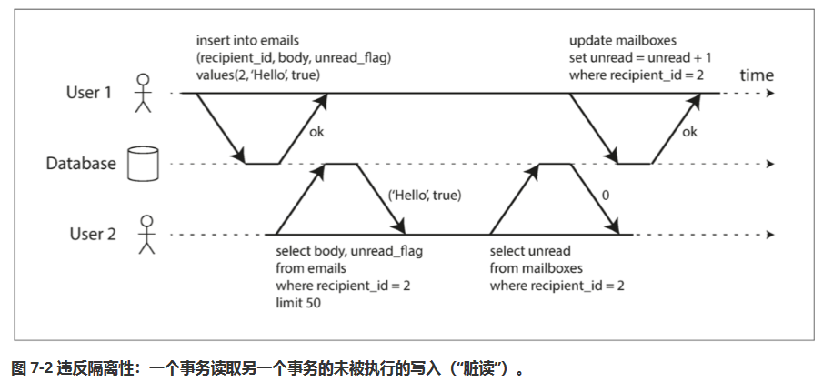
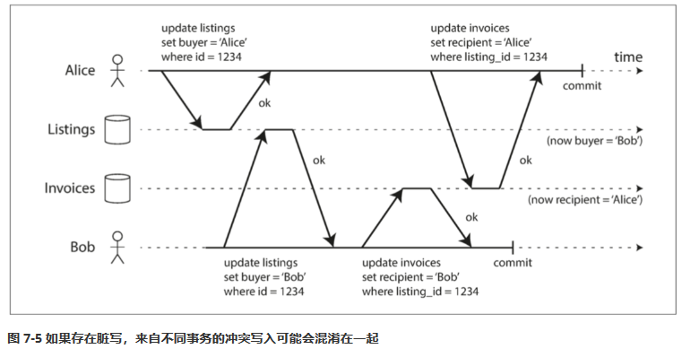
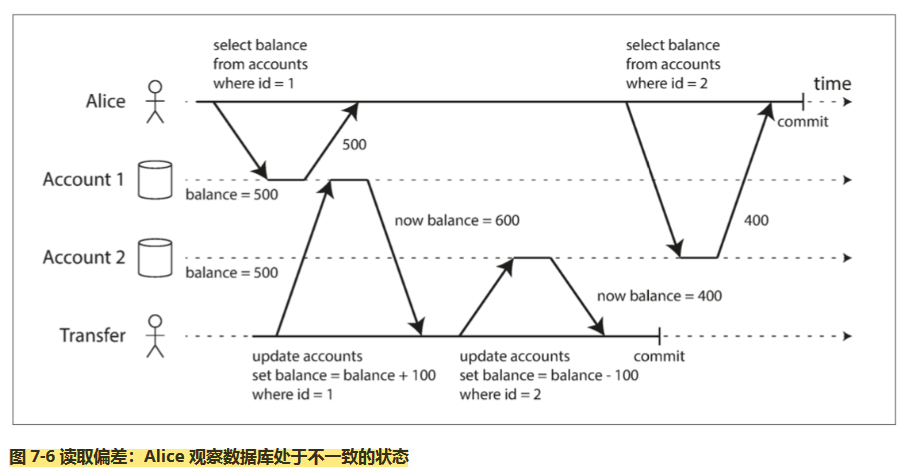
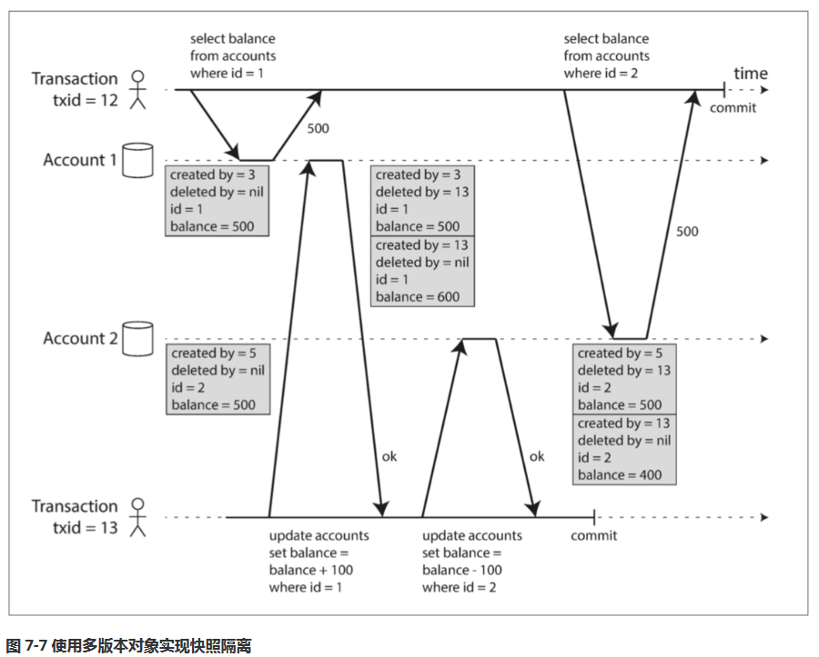

# 第七章：事务

## 什么是事务

事务是数据库提供给用户使用的一种并发控制方法和错误恢复手段，用于简化上层应用的编程模型。

> 数据库中的并发控制和容错需要考虑的内容非常多，直接将简单的锁机制暴露给用户显然不是什么优雅的方案，也不一定能保证安全性。

事务提供能力可以用ACID特性概括：

1. 原子性（Atomicity）

原子性提供了事务要么完全成功，要么完全失败的特性。

其实更多的是对失败的事务的定义，事务被终止意味着之前做的变更都将被丢弃。

> 这和并发编程中的原子操作显然不一样，那里更强调互斥或者独占

2. 一致性（Consistency）

ACID中的一致性强调其实不是事务的一致性，而是数据库中的数据的一致性，而这种一致性其实用户(应用程序)规定的

比如会计系统中所有账户必须借贷相抵，符合用户定义的规则的数据才算是一致的，而数据库只管存储。

> 当然特定类型的约束规则，比如外键、唯一数据库是提供的

故，一致性是用户通过事务的提供的AID特性去实现的，而不是事务本身的。

3. 隔离性（Isolation）

隔离性通俗来说指同时并发执行的事务之间互不影响。

隔离性个人认为是事务最终要的特性，不同的隔离级别提供的事务并发控制的能力。

但隔离二字其实是很有误导性的，比如下文所说的最基础的隔离级别事务只能"读已提交的事务"，从感性上好像事务之间就已经隔离开来了互不影响了。

但实际只解决非常基础的并发问题，完全没法使用。

4. 持久性（Durability)

持久性是一个承诺，一旦事务成功，那么无论如何（崩溃）写入数据也不会丢失。

### 多对象和单对象操作

多对象和单对象操作都需要事务的原子性和隔离性。

**多对象操作**

举个例子，数据库中存储了一个邮件列表，一个未读邮件数量计数器（非规范设计，加快查询速度避免遍历邮件列表）

多个事务同时执行，会出现的第一个问题 - "脏读"：



此时另一个用户同时读，会发现邮件列表中有未读邮件但未读数量为0。

这就是所谓的违反了事务的隔离性，一个事务读取到了另一个事务的中间结果。

> 其实对于用户来说这里就是出现了不一致了

另外对于原子性一样，比如计数器更新失败，事务之前的操作都将被撤销，避免造成不一致

**单对象操作**

最经典的单对象并发问题是丢失更新，这也需要隔离性去保障。

一个稍大的单对象，写到一半，网络断开、电源故障等，这些需要原子性去保证不会出现错误的数据。

## 弱隔离级别

当多个事务同时访问相同的数据时就会出现竞争条件，数据库通过为事务赋予隔离性来隐藏并发问题。

**可串行化**的隔离级别，意味着并发的事务的执行结果和事务已某种顺序串行执行的结果一致。

事实上可串行化的隔离级别是最强的隔离级别可以完全并发问题。但实现它会导致性能的损失，某些数据库是无法接受的。

故数据库会选择提供稍弱的隔离级别，或者提供多种隔离级别供用户选择。

> 代价则是弱隔离级别会允许一些并发问题出现，这里问题实际在历史上发生过并导致资金损失

### 读已提交

**读已提交（Read Committed）**是最基本的事务隔离级别，它提供了两个保证：

1. 从数据库读时，只能看到已提交的数据（没有 脏读，即 dirty reads）
2. 写入数据库时，只会覆盖已提交的数据（没有 脏写，即 dirty writes）

#### 没有脏读

脏读，即另一个事务可以看到另一个未提交事务所作的修改。

> 提示：不管是脏读还是脏写还是其他下文会提到的并发问题，其实非常简单/简洁，它就是指直接给出的定义的那种情况。
> 这些概念本身就是只对应一类并发问题

脏读导致的问题：

1. 多对象更新时，用户可能只能看到部分的更新，读到不一致的结果让人疑惑。（甚至在备份等场景下，这就是错误）
2. 事务具有原子性，失败可能回滚，这将导致其读到未实际提交的数据

#### 没有脏写

两个事务同时更新相同的对象，后执行的事务可能覆写前一个未提交事务写入的值，这被称为脏写。

读已提交通常通过写锁延迟第二次操作，来防止脏写。

脏写导致的问题：

1. 事务操作多个对象时，同样会造成不一致出现奇怪的场景。比如，一个车辆销售网站，用户买入一辆车需要两个操作：先更新商品列表，再更新发票列表。Alice和Bob同时买，脏写可能导致网站显示车辆时Bob买入的但发票开给了Alice。如图所示。



**尽管读已提交的隔离级别防止了脏读和脏写，但其仍然不能避免丢失更新、不可重读等问题**

#### 实现读已提交

读已提交是一个非常流行的隔离级别。这是 Oracle 11g、PostgreSQL、SQL Server 2012、MemSQL和其他许多数据库的默认设置。

防止脏写最常见的情况是使用**行锁（row-level lock）**，当事务要修改特定对象时必须先获得对应的锁，然后持有该锁直到事务被提交或者中止。

防止脏读最简单的方法和上面防止脏写使用同一把锁，但这样在实践中效果不好，长时间运行的写入事务会导致许多读事务的延迟。

出于这个原因，大多数数据库防止脏读的方式是记录旧值，和未提交的新值。当未提交时一律只能读到旧值，提交后其他事务才能读到新值。

> 从这些实现机制也可以看出，读已提交是真的只能防止严格的脏读和脏写，其他什么都避免不了

### 可重复读与快照隔离

在已实现了读已提交隔离级别的基础上，来看第一个它不能处理的并发问题 - 不可重读



这是一个经典的转账问题，Alice有两个账户，假设她现在同时进行账户余额的查看和转账。

在开始操作之前，她两个账户中一共有1000美元，如果这两个事务按照图中的时序执行，Alice查询的结果发现她两个账户加起来只有900美元了。

导致的这个异常的原因在于Alice读取Account2时（读到400），此时Account1其实已经变成600了，但Alice使用的是之前那读到的旧值500，所以导致了不一致。

可以看到Alice的两个事务确保了读已提交（没有脏读也没有脏写），但仍然出现了不一致。

这种异常就被称为**不可重读**或者**读取偏差**。当然只要Alice在事务结束后再次查询就返回正确的结果。

> 不可重读，不是说一定要再重新去读一次这种场景毕竟很少，这里的举例这种场景仍然是不可重读。

在某些场景下无法容忍这种不一致：

1. 备份，如果备份时读到的是这种不一致的结果，那么从备份恢复时，消失的钱就真的消失了。
2. 分析查询和完整性检查，这将导致这些分析结果和检查结果毫无意义。

解决这个问题最常见的解决方案是**快照隔离（snapshot isolation）**，核心想法是所有的读取都从一个**一致快照**上读取，这样就不会读取到不一致的结果，并且自然防止了脏读。

快照隔离对长时间运行的只读查询（如备份和分析）非常有用。如果查询的数据在查询执行的同时发生变化，则很难理 解查询的含义。当一个事务可以看到数据库在某个特定时间点冻结时的一致快照，理解起来就很容易了。

快照隔离是一个流行的功能：PostgreSQL、使用 InnoDB 引擎的 MySQL、Oracle、SQL Server 等都支持

#### 实现快照隔离

和读已提交防止脏写方法的类似，快照隔离也使用写锁来防止脏写。

但读取不需要加锁，快照的核心原则是：读不阻塞写，写不阻塞读

为了实现快照隔离，数据库使用了我们之前用于防止脏读的机制的一般化。数据库必须可能保留一个对象的几个不同的提交版本，因为各种正在进行的事务可能需要看到数据库在不同的时间点的状态。因为它同时维护着单个对象的多个版本，所以这种技术被称为**多版本并发控制（MVCC, multi-version concurrency control）**

由于快照隔离对整个事务都使用同一个快照，这不仅防止了不可重读问题，也保证了不会脏读。

下图说明了PostgreSQL如何实现基于MVCC的快照隔离（其他实现类似）。当一个事务开始时，它被赋予一个唯一的，永远增长的事务ID（ txid ）。每当事务向数据库写入任何内容时，它所写入的数据都会被标记上写入者的事务ID。



表中的每一行都有一个`created_by`字段，其中包含将该行插入到表中的的事务 ID。此外，每行都有一个`deleted_by`字段，最初是空的。如果某个事务删除了一行，那么该行实际上并未从数据库中删除，而是通过将`deleted_by`字段设置为请求删除的事务的ID来标记为删除。在稍后的时间，当确定没有事务可以再访问已删除的数据时，数据库中的垃圾收集过程会将所有带有删除标记的行移除，并释放其空间。

UPDATE操作在内部翻译为`DELETE`和`INSERT`。

#### 观察一致性快照的可见性规则

现在数据库中的所有数据都带有事务ID，可以通过为当前事务定义对事务ID的可见性规则，达到读取一致快照的要求。

当一个事务启动时，赋予它一个事务ID记为`cur_trx_id`，这个ID应该是唯一且严格递增的。

同时在事务启动时，记录当前数据库中所有活动的事务（尚未提交或终止的）ID，记为`trx_ids`数组。

同时设该事务要读取的数据库中的任意提一条数据的事务ID为`trx_id`。（其实就是上图的`created_by`)

故事务的不可见规则为：

1. `trx_id in trx_ids`该数据为当前活动事务修改的不可见，应该继续往版本链之前查找更早的数据。
2. `trx_id > max(trx_ids) && trx_id != cur_trx_id`（或者`trx_id > cur_trx_id`毕竟严格递增）在当前事务之后开启的事务修改的，也不可见，继续往前找更早的。

而`trx_id == cur_trx_id`自己修改的，自然可见。其他情况同理。

另外还需要注意对于`deleted_by`，如果根据某条数据的`trx_id`其此时是可见的，但`deleted_by`的事务ID也是可见的那么这条数据就是被删除的。

但如果根据`trx_id`可见，但`deleted_by`不可见，此时说明删除还未被提交，该条数据有效。

#### 索引与快照隔离

在使用快照隔离后，索引该如何工作？最简单的方法就是使索引指向对象版本链的头部，再来根据可见性规则过滤数据。当垃圾收集删除任何事务不再可见的旧对象版本时，相应的索引条目也可以被删除。

> 原文为：一种选择是使索引简单地指向对象的所有版本，并且需要索引查询来过滤掉当前事务 不可见的任何对象版本。
> 我想说的时，原文中没有强调版本链条，甚至没有出现。而对于一致快照来说，显然只能从最新的向下找，不然读到不同的旧版，快照隔离就没有意义了。


原文提到的CouchDB、Datomic和LMDB使用什么**紧追加/写时拷贝**的B树索引没有看懂，需要进一步查文献


#### 可重复读与命名混淆

许多数据库都实现了快照隔离，但名字不同，如Oracle 中称为 可串行化（Serializable）的，在 PostgreSQL 和 MySQL 中称为 可重复读（repeatable read）

最后，IBM DB2使用“可重复读”来引用可串行化。 结果，没有人真正知道可重复读的意思。

### 防止丢失更新

无论是读已提交还是快照隔离都考虑了脏写的问题，而没有考虑其他的并发写入问题。比如这里的丢失更新问题。

如果两个事务同时执行，从数据库中读一个值，修改它并将其写回，则有可能发生丢失更行问题。

最经典的就是增加计数器的问题。

> 太经典不再赘述

丢失更新是一个非常普遍的问题，所以各种解决方案。

#### 原子写

数据库直接提供原子更新操作，从而消除在应用程序的读取-修改-写入序列的必要：

```sql
UPDATE counters SET value = value + 1 WHERE key = 'foo';
```

原子操作可以在操作对象时获取排它锁实现。

#### 比价并设置(CAS)

这其实也是一种原子操作，只不过是一种乐观原子操作。即先直接读取旧值，然后计算做修改，完成后在要写入时同时传入新值和旧值，如果旧值没变则执行写入，如果变了则返回失败。失败后用户重新执行读取、计算、再CAS的操作。

```sql
-- 根据数据库的实现情况，这可能安全也可能不安全
UPDATE wiki_pages SET content = '新内容'
        WHERE id = 1234 AND content = '旧内容';
```

但如果数据库允许`WHERE`子句读取旧值，则可能防止丢失更新无法被保证。

#### 显示锁定

 将锁下放给用户（应用程序），由用户显示加锁，比如Select的`FOR UPDATE`子句。

```sql
BEGIN TRANSACTION; 
SELECT * FROM figures  WHERE name = 'robot' AND game_id = 222 FOR UPDATE; 

-- 检查玩家的操作是否有效，然后更新先前 SELECT 返回棋子的位置。 
UPDATE figures SET position = 'c4' WHERE id = 1234; 
COMMIT;
```

`FOR UPDATE`子句告诉数据库在改查询返回的所有行上加锁。

但这样就需要由用户程序去在所有合适的地方加锁，不能很可能引入竞争条件。

#### 自动检测丢失的更新

另一种不需要加锁的方法是允许事务并行的发生，再由事务管理器来检测丢失更新，检测到丢失更新后通过终止事务，并让其重新执行

这个方法可以结合快照隔离高效地执行检查。，PostgreSQL 的可重复读，Oracle 的可 串行化和 SQL Server 的快照隔离级别，都会自动检测到丢失更新，并中止惹麻烦的事务。但是，MySQL/InnoDB 的可 重复读并不会检测 丢失更新。一些作者认为，数据库必须能防止丢失更新才称得上是提供了 快照隔 离，所以在这个定义下，MySQL 下不提供快照隔离。

#### 冲突解决和复制


还没有看前面的章节，之后再来修改。


### 写入偏差与幻读

## 可串行化
