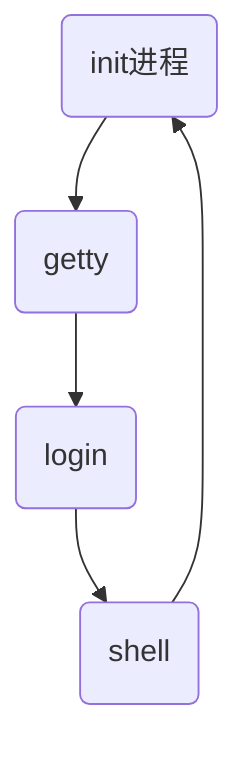

# UNIX简介

UNIX系统最初由贝尔实验室开发，随后发展为商用操作系统。
UNIX主要有两个版本：
* AT&T公司发布的System V
* 加利福利亚Berkeley分校 UNIX（BSD）

其他的UNIX系统变体基本都基于这个两个版本
> 伯克利分校发布4.4BSD2后，BSD就停止发展了。
> 从这以后一些基于4.4BSD的版本如FreeBSD、OpenBSD仍在发展
> AT&T的System V第四版（SVR4）是UNIX标准化的一个结果（系统调用接口）推动了可在所有UNIX上运行的程序的开发，该接口称为SVID（SV Interface Definition）。
> 而其他UNIX厂商联合相关UNIX产品开发商制定了POSIX（Portable Operating System Interface for Computer  Environment）标准。
> POSIX很大程度上基于SVID。

## || 其他UNIX系统

### Linux
Linux不同于UNIX，是一个完全自由发布的UNIX版本。
> 由于版权Linux不叫UNIX，但实际上它就是UNIX。Linux遵循很多与UNIX一样的标准

### Solaris
SunOS后称Solaris，最初是Sun公司基于SV2和BSD 4.3开发的。后Solaris2.0基于SVR4开发。

### UnixWare
UnixWare是基于SV系统的，只能用于Intel 处理器的计算机

# UNIX入门

## || UNIX登录过程
UNIX完成启动后，init进程会为每个终端启动一个getty程序，负责在屏幕显示`login:`等信息并等待用户输入用户名，getty程序读取用户名后传递给login程序，然后login显示`password:`字符串并等待用户输入密码，login验证口令正确后则会根据用户定义启动一个shell程序，并进入用户主目录。



## || UNIX用户

用户信息保存在`/etc/passwd`文件中，每个用户在该文件中用一行表示，每一行由7个用冒号分隔的字段表示。这些字段的含义如下：（按顺序）
```
root:x:0:0::/root:/bin/bash
```
* login-name
* password，存储加密口令。SVR4中加密口令单独保存在`/etc/shadow`，此处使用x做占位符
* user-id
* group-id
* user-info，用户描述字段
* directory，用户主目录
* program，指定登录后要运行的程序，一般是一个shell

`passwd`命令可修改当前用户的口令。
> 要添加/删除用户可以直接编辑`/etc/passwd`文件（需要root权限），但一般使用`useradd`指令更安全。

## || UNIX简单命令
> 自行使用man或者--help参数查看帮助

### 显示日期与时间：date

### 当前登录用户信息：who

### 日历：cal

### 获取帮助：--help/man


