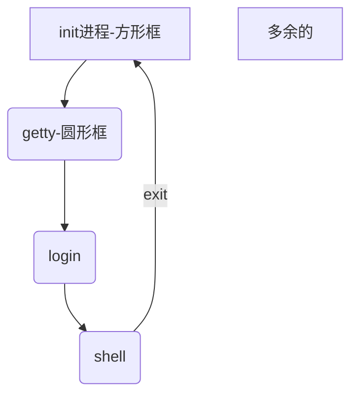

## 概述
Markdown主要包括两类语法元素：

*	**块级元素**
*	**内联元素**

除此之外，在Markdown文件中还可以插入HTML标记。 
但是HTML块级标记需要另起一行单独放置，并且开始和结束标记之前不能有缩进。而HTML内联级标记则可以在任何的地方使用。

> 在MD语法文档中说，m'd是用于*创作web文档*的。所以MD可以很容易达到HTML的最终渲染效果，并且也很容易转换为HTML文档。不妨类比HTML的效果来学习MD会稍微易于记忆

## 块级元素
### 段落
段落就是连续的多行文本，并且在开始时不能有缩进。并且换行和多余的空格不会生效。这个特性就和`<p>`非常相似了。至于不能缩进估计是为了和另一个MD块级元素做区分——代码块。
要在段落中换行，可以插入`<br/>`，或者在末尾添加两个空格并换行。
> 关于直接换行不能生效，在CSDN的MD编辑器和Typora中是可以生效的，但在gitee中不会生效，github中则表现为块引用。这应该和MD文档到HTML的转换器有关。

### 标题
MD有两种标题
1.	任意数量的=做一级标题，-做二级标题
	```
	一级标题
	======
	二级标题
	------------
	```
	一级标题
	======
	二级标题
	------------
2.	使用连续的井号开头，之后跟一个或多个空格。一共6级
	```
	# H1
	## H2
	### H3
	```
	# H1
	## H2
	### H3

### 块引用
`>`提供块引用
```
> 块块块块块块块块块块块
块块块块块块块
>
> 块
> ### Head
> `code`
```
> 块块块块块块块块块块块
> 块块块块块块块
>
> >块
> ### Head
> 		code block
>
> `inline code`

值得注意的是，在块中强制换行不像段落一样，直接换行就行了。  
另外在块中可以自由的使用其他的MD元素。并且块可以嵌套。

### 列表
MD中有无序和有序列表。无序列表使用`*`，`+`，`-`加上一个以上的空格均可，并可混用，有序直接`1.`，`2.`即可，见示例。
```
* list list list list
list list
* item.
1. one
2. two
```

* list list list list
list list
* item.
1. one
2. two

此处段落直接换行也是可以的。另外在列表中也可以使用其他MD元素，但是需要相同的缩进（水平制表符，或者4个空格）
```
*	一个段落

另一个段落
*	一个段落

	另一个段落
```
*	一个段落

另一个段落
*	一个段落

	另一个段落

> 此处在实际测试中，其实就算缩进不是相同的，只要有缩进也会放在相应的列表项下，跟MD实现有关吧。
> 对于：1986. What a great reason.会转换为列表，只需对`.`转义即可，1986\.

### 代码块
插入代码块，只需要每一行都缩进4行或者一个水平制表符。如果不想缩进也可以使用一对<code>```</code>，当然也可以使用HTML标签`<code>`。

```
段落

	#include <iostream>
	using namespace std;
	int main(){ return 0; }

段落
```

段落

	#include <iostream>
	using namespace std;
	int main(){ return 0; }

段落

### 水平线
一行中有三个以上的星号，连字符，下划线都会生成水平线。空格是允许的。
```
* * *
****
---
- - -
```
* * *
****
---
- - -

## 内联元素
### 链接和图片
先说普通链接，MD支持内联和引用两种链接。这两种链接方式都使用`[]`界定需要链接的的文字。 

对于内联链接用法如下
```
it is a [link](https://baidu.com, "baidu") to baidu.
```
it is a [link](https://baidu.com, "baidu") to baidu.

`[]`后面的括号中跟http链接或者同服务器的本地资源，链接后的的`"baidu"`其实就是对应于`<a>`标签的title属性，也就是鼠标移到链接上的提示。

对于引用链接，就像论文引用一样，`[]`后面不直接跟http链接而是一个标识符，之后再列出所有的标识符对应的http链接。后面的跟的title可以使用双引号、单引号、括号，http链接还可以使用`<>`包裹。
```
this is a [link][A] to baidu.
this is a [link][B] to google.
this is a [link][B] to csdn.

[A]:    https://baidu.com	"baidu"
[B]:    <https://google.com>	'google'
[C]:	  https://www.csdn.net (csdn)
```
this is a [link][A] to baidu.
this is a [link][B] to google.
this is a [link][B] to csdn.

[A]:    https://baidu.com	"baidu"
[B]:    <https://google.com>	"google"
[C]:	  https://www.csdn.net "csdn"

> 引用需要单独起一行（其实是需要一个空行）

也可以使用当前`[]`框住的文字本身做标识符，称作隐藏链接名称。

```
this is [baidu][] link.
this is [google][] link.

[baidu]:    https://baidu.com	"baidu"
[google]:    <https://google.com>	'google'
```
this is [baidu][] link.
this is [google][] link.

[baidu]:    https://baidu.com	"baidu"
[google]:    <https://google.com>	"google"

另外也可以直接将http链接链接到其本身，使用`<>`框选http链接。
```
baidu link: <https://baidu.com>
```
baidu link: <https://baidu.com>

使用图片和链接唯一的不同就是在`[]`前加上`!`，并且`[]`中的内容变为了alt值，其他和链接相似，包括内联和引用。
```

![图片描述][AM]

[AM]: https://img-blog.csdnimg.cn/20210410111130883.png  (哆啦A梦)
```

![图片描述][AM]

[AM]: https://img-blog.csdnimg.cn/20210410111130883.png  "哆啦A梦"


## 其他补充
*	反斜杠转义，没啥可说的
*	其他的在MD可以自由使用<>，&等符号可以自动转换为字符实体等。其他的转换规则，包括在code块中的转义和一些特殊用法自行摸索吧。
*	另外MD还支持表格和流程图的语法。这里不再赘述，使用表格其实也可以使用`<table>`标签。可以看一下[这篇简书](https://www.jianshu.com/p/191d1e21f7ed)，里面简单介绍了表格语法和流程图。

## 流程图（补充）
流程图本质是通过代码块实现的。

### 横向竖向流程图

	```mermaid
	graph TB
	A(init进程)-->B(getty)
	B-->C(login)
	C-->D(shell)
	D-->A
	```

> `TB`改成`LR`则为横向流程图

### 标准流程图
标准流程图需要先定义元素，然后再来连接
> 参考<https://blog.csdn.net/u011628753/article/details/123017689>

参考：

[Markdown中文文档](https://markdown-zh.readthedocs.io/en/latest/)
