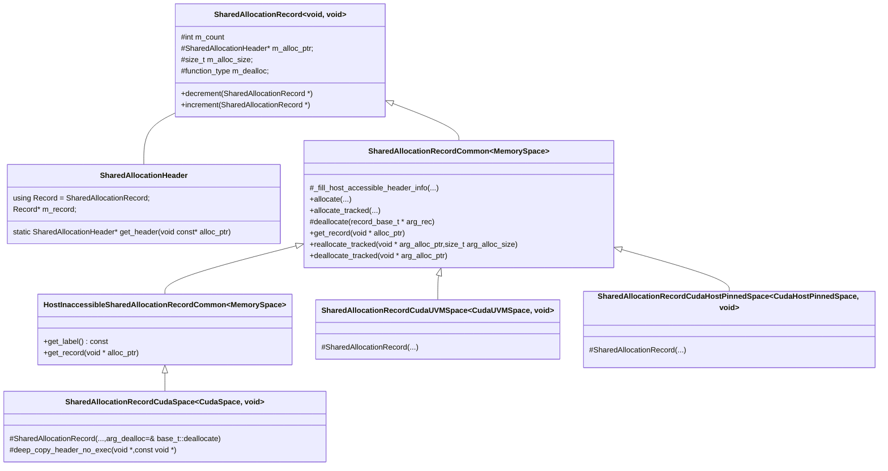

# Kokkos Core Cuda Backend

Cuda作为后端的源码分析。

主要内容：

1. Cuda内存空间
2. Cuda执行空间
3. `parallel_for`，`parallel_reduction`

由于Cuda存在自身的编程模型，Kokkos的Cuda后端实现更多是对Cuda API的封装和抽象

> 该文档仅仅作为源码的补充，必须看源码才能理清楚逻辑关系

> 在kokkos C++ 线程后端文档里有比较详细的入口逻辑，这里不在赘述（比如kokkos如何管理执行空间）

## || Cuda内存空间

**涉及到的主要文件**

文件名|描述
:-:|:-:
Kokkos_CudaSpace.hpp|Cuda内存空间相关类型声明
Cuda/Kokkos_CudaSpace.cpp|Cuda内存空间定义
imp/Kokkos_SharedAlloc.hpp|SharedAlloctionRecord的基类声明
imp/Kokkos_SharedAlloc_timpl.hpp|SharedAllocationRecord的定义

Cuda内存空间抽象的主要功能非常明显，就是负责对GPU内存空间的分配和释放。


Kokkos定义了三类Cuda内存空间：

1. `class CudaSpace`对应于使用`cudaMalloc`管理的空间，也就是手动管理的全局内存空间
2. `class CudaUVMSpace`对应于`cudaMallocManaged`管理的统一内存空间
3. `class CudaHostPinnedSpace`对应于使用`cudaHostAlloc`的管理的固定主机内存空间

三个类型管理内存空间的成员函数就是`allocate`和`deallocate`.

以下为`CudaUVMSpace`的具体实现：

```cpp
void *CudaUVMSpace::allocate(const char *arg_label, const size_t arg_alloc_size,
                             const size_t arg_logical_size) const {
  return impl_allocate(arg_label, arg_alloc_size, arg_logical_size);
}

void *CudaUVMSpace::impl_allocate(
    const char *arg_label, const size_t arg_alloc_size,
    const size_t arg_logical_size,
    const Kokkos::Tools::SpaceHandle arg_handle) const {
  void *ptr = nullptr;

  // static_fence是cudaDeviceSyn，同步整个设备
  Cuda::impl_static_fence(
      "Kokkos::CudaUVMSpace::impl_allocate: Pre UVM Allocation");
  if (arg_alloc_size > 0) {
    Kokkos::Impl::num_uvm_allocations++;

    // 通过CUDA RTAPI分配UVM空间
    auto error_code =
        cudaMallocManaged(&ptr, arg_alloc_size, cudaMemAttachGlobal);

  ......

  }

  Cuda::impl_static_fence(
      "Kokkos::CudaUVMSpace::impl_allocate: Post UVM Allocation");
  if (Kokkos::Profiling::profileLibraryLoaded()) {
    const size_t reported_size =
        (arg_logical_size > 0) ? arg_logical_size : arg_alloc_size;
    Kokkos::Profiling::allocateData(arg_handle, arg_label, ptr, reported_size);
  }
  return ptr;
}
```

剩余的内存空间的实现类似，只不过对应不同的API(`cudaMalloc和cudaHostAlloc`)。

这里需要单独说明一下两点：

1. `arg_alloc_size`为要分配的实际内存大小，`arg_logical_size`为比实际内存大小要小的逻辑大小。因为实际分配的空间中，实际用于用户的只是这个逻辑大小，剩余的内存用于Kokkos用于内存管理。

2. 注意到这里的`arg_label`参数用来标识一个分配的内存空间，主要用于Kokkos的Profiling模块。同时这个Profiling同时还记录了分配的空间地址，有时可以看到在初始化时分配了一块内存空间却放在局部内存空间中，也没有释放，这并不会导致内存泄漏。

Cuda内存空间的定义非常的简单，但通常在使用时Kokkos并不会直接使用这个接口。而是通过一个高层封装`SharedAllocationRecord`

`SharedAllocationRecord`从名字可以看出是可以对指针共享的，所以里面有一个计数器，当计数器减少到0才实际释放。

> 可能还有其他含义，现目前主要关注他的共享

`SharedAlloctionRecord`实现起来就稍微复杂一点了，主要的复杂度在于其需要支持所有的内存空间（不只是的Cuda的）。

> 由于Markdown对模板类图的支持实在不是很好，这里的图非常的简略，并且其不支持特化模板的语法，所以`SharedAllocationRecordCudaSpace`这种其实只是特化模板，后面的`CudaSpace`其实是不需要的，然后继承也是，`SharedAllocationRecordCommon`利用了CRTP模式，不同子类其实继承是不同的模板实例，这里也没有再区分了

> 请自行参照源代码



一个Record其实在内存中分为两个部分，以`CudaUVMSpace`为例，可以使用以下方法分配一块内存空间：

```cpp

void * prt = SharedAllocationRecord<CudaUVMSpace, void>::allocate_tracked(CudaUVMSpace(), "", size);

// 具体实现
template <class MemorySpace>
auto SharedAllocationRecordCommon<MemorySpace>::allocate(
    MemorySpace const& arg_space, std::string const& arg_label,
    size_t arg_alloc_size) -> derived_t* {
  return new derived_t(arg_space, arg_label, arg_alloc_size);
}

template <class MemorySpace>
void* SharedAllocationRecordCommon<MemorySpace>::allocate_tracked(
    const MemorySpace& arg_space, const std::string& arg_alloc_label,
    size_t arg_alloc_size) {
  if (!arg_alloc_size) return nullptr;

  SharedAllocationRecord* const r =
      allocate(arg_space, arg_alloc_label, arg_alloc_size);

  record_base_t::increment(r);

  return r->data();
}
```

可以看到`allocate_tracked`就是调用的`allocate`然后将计数器加一。

而`allocate`其实就是利用的CRTP语法new一个子类对象。

通过子类对象的构造函数可以发现：

```cpp
SharedAllocationRecord<Kokkos::CudaUVMSpace, void>::SharedAllocationRecord(
    const Kokkos::CudaUVMSpace &arg_space, const std::string &arg_label,
    const size_t arg_alloc_size,
    const SharedAllocationRecord<void, void>::function_type arg_dealloc)
    // Pass through allocated [ SharedAllocationHeader , user_memory ]
    // Pass through deallocation function
    : base_t(
          // 这个函数实际执行的CudaUVMSpace.allocate(...)
          Impl::checked_allocation_with_header(arg_space, arg_label,
                                               arg_alloc_size),
          sizeof(SharedAllocationHeader) + arg_alloc_size, arg_dealloc,
          arg_label),
      m_tex_obj(0),
      m_space(arg_space) {
  this->base_t::_fill_host_accessible_header_info(*base_t::m_alloc_ptr,
                                                  arg_label);
}
```

该构造函数实际调用的`CudaUVMSpace.allocate`分配的内存空间，这里分配的内存空间实际比用户指定的大小多分配了一个`sizeof(SharedAllocationHeader)`大小的内存区域。

在这个header里面记录Record的内存地址。

所以实际的`SharedAllocationRecord`对象在主机内存内，包括了一个指向分配的具体执行空间的内存块指针，分配大小，引用计数等。而具体内存空间中分配的每块内存都有一个header里面又一个指针指回Record。

> 所以现在可以直接从分配的一个地址得到一个Record（如`ptr-sizeof(header)->m_record`）

但是`CudaSpace`内存空间的稍有不同，可以看到在`SharedAllocationRecordCommon`和`SharedAllocationRecord<CudaSpace, void>`之间存在一个`HostInaccessibleSharedAllocationRecordCommon`，这是由于主机无法直接访问用户分配在`CudaSpace`的内存，也就无法直接读取header中Record的指针，所以封装一下，在`get_record`里面和其他的不同，需要先将header拷贝到主机，然后再读取。

然后`increment()`和`decorement()`就是负责将Record中的计数器递增的和递减的，将递减到0时，`increment`自动执行`deallocate`，这个Record的`deallocate`又会调用具体某个内存空间的`deallocate`

> 必须要查阅源代码才能更好的理解

## || Cuda执行空间

**涉及的文件**

文件名|描述
:-:|:-:
Kokkos_Cuda.hpp|`Cuda`声明
Cuda/Kokkos_Cuda_Instance.hpp|涉及`Cuda`实现的一些声明
Cuda/Kokkos_Cuda_Instance.cpp|具体定义（实现）

`Cuda`具体实现是通过内部类`CudaInternal`来完成的。

> `Cuda`更像`CudaInternal`代理，每个`Cuda`实例里都必须包含一个`CudaInternal`实例

> 每个`Cuda`类实例可以指定一个stream

这里`Cuda`的好像除了`initialize`和作为一个执行空间类型没有太多的功能。

这里主要介绍一下`CudaInternal`的`initialize`和Scratch的一些内容。

`CudaInternal::initilize`主要对一些静态变量进行初始化，比如读取cudaProp获取一些设备信息，设置目标GPU（cudaSetDevice）等，这些设备信息可以用来在启动核函数时计算最佳的block_size提供依据。

其次就是分配一些缓冲区。
```cpp
......
/* 这三个都是使用SharedAllocationRecord分配的
* 没有太多的特殊之处，除了分配的大小调整为ScratchGrain的倍数
* */
// 16*sizeof(size_type)太小了，相当于只分配了一个ScratchGrain长度的HostPinnedSpace
(void)scratch_unified(16 * sizeof(size_type));
// 在CudaSpace分配的大小为reduce_block_c*2*sizeof(size_type)
(void)scratch_flags(reduce_block_count * 2 * sizeof(size_type));
// 也在CudaSpace上分配，也就是的调用cudaMalloc分配的
(void)scratch_space(reduce_block_count * 16 * sizeof(size_type));

.....

// Allocate a staging buffer for constant mem in pinned host memory
// and an event to avoid overwriting driver for previous kernel launches
if (stream == nullptr) {
KOKKOS_IMPL_CUDA_SAFE_CALL(
    cudaMallocHost(reinterpret_cast<void **>(&constantMemHostStaging),
                   CudaTraits::ConstantMemoryUsage));

KOKKOS_IMPL_CUDA_SAFE_CALL(cudaEventCreate(&constantMemReusable));
}
```

这里单独把这几个变量的分配拿出来，是因为之后在`parallel_for`和`parallel_reduction`里面需要用到。

## || parallel_for

这里还是通过最简单的`RangePolicy`来说明`parallel_for`是如何将用户定义的Functor函数并行化的。

任选一个特化模板：

```cpp

template <
    class ExecPolicy, class FunctorType,
    class Enable = std::enable_if_t<is_execution_policy<ExecPolicy>::value>>
inline void parallel_for(const std::string& str, const ExecPolicy& policy,
                         const FunctorType& functor) {
  uint64_t kpID = 0;

  ExecPolicy inner_policy = policy;
  Kokkos::Tools::Impl::begin_parallel_for(inner_policy, functor, str, kpID);

  Kokkos::Impl::shared_allocation_tracking_disable();

  // 关键点
  Impl::ParallelFor<FunctorType, ExecPolicy> closure(functor, inner_policy);
  Kokkos::Impl::shared_allocation_tracking_enable();

  closure.execute();

  Kokkos::Tools::Impl::end_parallel_for(inner_policy, functor, str, kpID);
}
```

可以看到这里构造了一个`ParallelFor`对象，然后执行了其`execute`函数。

> 其他语句可以先不用管，主要是和Profiling相关的操作。不影响`parallel_for`的功能

这里的ExecPolicy加入用户传递进来的是`RangePolicy`，而`ParallelFor`有三个模板参数，这里未指定第三个参数，则使用默认参数`DefaultExecutionSpace `，这里我们讨论cuda，默认就假设其是`Cuda`。

如此将会将会匹配到如下的特化模板：

```cpp
template <class FunctorType, class... Traits>
class ParallelFor<FunctorType, Kokkos::RangePolicy<Traits...>, Kokkos::Cuda> {
 public:
  using Policy = Kokkos::RangePolicy<Traits...>;

 private:
  using Member       = typename Policy::member_type;
  using WorkTag      = typename Policy::work_tag;
  using LaunchBounds = typename Policy::launch_bounds;

  const FunctorType m_functor;
  const Policy m_policy;

  ParallelFor()        = delete;
  ParallelFor& operator=(const ParallelFor&) = delete;

  template <class TagType>
  inline __device__ std::enable_if_t<std::is_void<TagType>::value> exec_range(
      const Member i) const {
    m_functor(i);
  }

  template <class TagType>
  inline __device__ std::enable_if_t<!std::is_void<TagType>::value> exec_range(
      const Member i) const {
    m_functor(TagType(), i);
  }

 public:
  using functor_type = FunctorType;

  Policy const& get_policy() const { return m_policy; }

  inline __device__ void operator()() const {
    // 这个work_stride其实就是整个grid里面的线程数量，可能比向量的len大也可能小
    // 大那每个线程就负责一个数据，小则需要+work_stride
    const Member work_stride = blockDim.y * gridDim.x;
    const Member work_end    = m_policy.end();

    for (Member iwork =
             m_policy.begin() + threadIdx.y + blockDim.y * blockIdx.x;
         iwork < work_end;
         // 不如iwork+work_stride < work_end好理解
         iwork = iwork < work_end - work_stride ? iwork + work_stride
                                                : work_end) {
      this->template exec_range<WorkTag>(iwork);
    }
  }

  // 这里无法直接指定blocksize只能够使用Launchbound进行一些暗示(get_opt_block_size())
  inline void execute() const {
    const typename Policy::index_type nwork = m_policy.end() - m_policy.begin();

    cudaFuncAttributes attr =
        CudaParallelLaunch<ParallelFor,
                           LaunchBounds>::get_cuda_func_attributes();
    const int block_size =
        Kokkos::Impl::cuda_get_opt_block_size<FunctorType, LaunchBounds>(
            m_policy.space().impl_internal_space_instance(), attr, m_functor, 1,
            0, 0);
    KOKKOS_ASSERT(block_size > 0);
    dim3 block(1, block_size, 1);
    // 常规计算方法
    // cuda_internal_maximum_grid_count就是cudaProp里面的gridsize的三个维度的限制
    dim3 grid(
        std::min(
            typename Policy::index_type((nwork + block.y - 1) / block.y),
            typename Policy::index_type(cuda_internal_maximum_grid_count()[0])),
        1, 1);
#ifdef KOKKOS_IMPL_DEBUG_CUDA_SERIAL_EXECUTION
    if (Kokkos::Impl::CudaInternal::cuda_use_serial_execution()) {
      block = dim3(1, 1, 1);
      grid  = dim3(1, 1, 1);
    }
#endif

    CudaParallelLaunch<ParallelFor, LaunchBounds>(
        *this, grid, block, 0, m_policy.space().impl_internal_space_instance(),
        false);
  }

  ParallelFor(const FunctorType& arg_functor, const Policy& arg_policy)
      : m_functor(arg_functor), m_policy(arg_policy) {}
};

```

上面代码基本包含了cuda ParallelFor的所有逻辑。

先看`execute`函数

```cpp
  // 这里无法直接指定blocksize只能够使用Launchbound进行一些暗示(get_opt_block_size())
  inline void execute() const {
    const typename Policy::index_type nwork = m_policy.end() - m_policy.begin();

    cudaFuncAttributes attr =
        CudaParallelLaunch<ParallelFor,
                           LaunchBounds>::get_cuda_func_attributes();
    const int block_size =
        Kokkos::Impl::cuda_get_opt_block_size<FunctorType, LaunchBounds>(
            m_policy.space().impl_internal_space_instance(), attr, m_functor, 1,
            0, 0);
    KOKKOS_ASSERT(block_size > 0);
    dim3 block(1, block_size, 1);
    // 常规计算方法
    // cuda_internal_maximum_grid_count就是cudaProp里面的gridsize的三个维度的限制
    dim3 grid(
        std::min(
            typename Policy::index_type((nwork + block.y - 1) / block.y),
            typename Policy::index_type(cuda_internal_maximum_grid_count()[0])),
        1, 1);

    CudaParallelLaunch<ParallelFor, LaunchBounds>(
        *this, grid, block, 0, m_policy.space().impl_internal_space_instance(),
        false);
  }

```

总体来看其实就是计算block_size，然后启动核函数，但是由于这里的`CudaParallelLaunch`的复杂性导致阅读起来比较困难，甚至连如何确定的block_size都不好看清。

所以这里先介绍`CudaParallelLaunch`这里模板类：

```cpp
// General launch mechanism
template <class DriverType, class LaunchBounds,
          Experimental::CudaLaunchMechanism LaunchMechanism>
struct CudaParallelLaunch<DriverType, LaunchBounds, LaunchMechanism,
                          /* DoGraph = */ false>
    : CudaParallelLaunchImpl<DriverType, LaunchBounds, LaunchMechanism> {
  using base_t =
      CudaParallelLaunchImpl<DriverType, LaunchBounds, LaunchMechanism>;
  template <class... Args>
  CudaParallelLaunch(Args&&... args) {
    base_t::launch_kernel((Args &&) args...);
  }
};
```

这里只简单讨论这一个特化模板，不考虑他这里的GraphNode。

这里类继承自`CudaParallelLaunchImpl`，实际的执行其实就是他的构造函数，里面直接调用了父类的`launch_kernel`函数。

```cpp
template <class DriverType, unsigned int MaxThreadsPerBlock,
          unsigned int MinBlocksPerSM,
          Experimental::CudaLaunchMechanism LaunchMechanism>
struct CudaParallelLaunchImpl<
    DriverType, Kokkos::LaunchBounds<MaxThreadsPerBlock, MinBlocksPerSM>,
    LaunchMechanism>
    : CudaParallelLaunchKernelInvoker<
          DriverType, Kokkos::LaunchBounds<MaxThreadsPerBlock, MinBlocksPerSM>,
          LaunchMechanism> {
  using base_t = CudaParallelLaunchKernelInvoker<
      DriverType, Kokkos::LaunchBounds<MaxThreadsPerBlock, MinBlocksPerSM>,
      LaunchMechanism>;

  inline static void launch_kernel(const DriverType& driver, const dim3& grid,
                                   const dim3& block, int shmem,
                                   const CudaInternal* cuda_instance,
                                   bool prefer_shmem) {
    if (!Impl::is_empty_launch(grid, block)) {

        ......

      Impl::configure_shmem_preference<
          DriverType, Kokkos::LaunchBounds<MaxThreadsPerBlock, MinBlocksPerSM>>(
          base_t::get_kernel_func(), prefer_shmem);

      // 有个全局的锁数组，需要保证用cudaMemcpyToSymbol初始化
      // 具体实现是一个主机数组一个设备数组，然后这个宏负责cpy到device上
      KOKKOS_ENSURE_CUDA_LOCK_ARRAYS_ON_DEVICE();

      // Invoke the driver function on the device
      base_t::invoke_kernel(driver, grid, block, shmem, cuda_instance);

    }
  }

  static cudaFuncAttributes get_cuda_func_attributes() {
    // Race condition inside of cudaFuncGetAttributes if the same address is
    // given requires using a local variable as input instead of a static Rely
    // on static variable initialization to make sure only one thread executes
    // the code and the result is visible.
    // 获取核函数的一些属性信息，比如attr里面也有maxThreadsPerBlock，这个数字是由具体的核函数(可能会考虑到核函数需要的寄存器和shmem的大小)和设备能力共同决定的，如果实际每个块的数量大于该值核函数将无法启动
    // 这和dev_prop的最大线程数可能不一样
    auto wrap_get_attributes = []() -> cudaFuncAttributes {
      cudaFuncAttributes attr_tmp;
      KOKKOS_IMPL_CUDA_SAFE_CALL(
          cudaFuncGetAttributes(&attr_tmp, base_t::get_kernel_func()));
      return attr_tmp;
    };
    static cudaFuncAttributes attr = wrap_get_attributes();
    return attr;
  }
};

```

这里类里面的两个成员函数，和`ParallelFor::execute`均有关。

`get_cuda_func_attributes`函数其实就是获取具体核函数相关的属性，比如核函数使用的寄存器数量、共享内存数量、每块最大线程数量等这些属性之后将被用来计算最佳的block_size

然后就是`launch_kernel`，这里又是通过父类`CudaParallelLaunchKernelInvoker`的`invoke_kernel`来实现的。

这里之所以搞得那么复杂，就是因为这里有三种启动机制。

```cpp
// localmemory
template <class DriverType, class LaunchBounds>
struct CudaParallelLaunchKernelInvoker<
    DriverType, LaunchBounds, Experimental::CudaLaunchMechanism::LocalMemory>
    : CudaParallelLaunchKernelFunc<
          DriverType, LaunchBounds,
          Experimental::CudaLaunchMechanism::LocalMemory> {
  using base_t = CudaParallelLaunchKernelFunc<
      DriverType, LaunchBounds, Experimental::CudaLaunchMechanism::LocalMemory>;
  static_assert(sizeof(DriverType) < CudaTraits::KernelArgumentLimit,
                "Kokkos Error: Requested CudaLaunchLocalMemory with a Functor "
                "larger than 4096 bytes.");

  static void invoke_kernel(DriverType const& driver, dim3 const& grid,
                            dim3 const& block, int shmem,
                            CudaInternal const* cuda_instance) {
    (base_t::
         get_kernel_func())<<<grid, block, shmem, cuda_instance->m_stream>>>(
        driver);
  }

};

// global memory
template <class DriverType, class LaunchBounds>
struct CudaParallelLaunchKernelInvoker<
    DriverType, LaunchBounds, Experimental::CudaLaunchMechanism::GlobalMemory>
    : CudaParallelLaunchKernelFunc<
          DriverType, LaunchBounds,
          Experimental::CudaLaunchMechanism::GlobalMemory> {
  using base_t = CudaParallelLaunchKernelFunc<
      DriverType, LaunchBounds,
      Experimental::CudaLaunchMechanism::GlobalMemory>;

  static void invoke_kernel(DriverType const& driver, dim3 const& grid,
                            dim3 const& block, int shmem,
                            CudaInternal const* cuda_instance) {
    DriverType* driver_ptr = reinterpret_cast<DriverType*>(
        cuda_instance->scratch_functor(sizeof(DriverType)));

    cudaMemcpyAsync(driver_ptr, &driver, sizeof(DriverType), cudaMemcpyDefault,
                    cuda_instance->m_stream);
    (base_t::
         get_kernel_func())<<<grid, block, shmem, cuda_instance->m_stream>>>(
        driver_ptr);
  }
};

// Constant Memory
template <class DriverType, class LaunchBounds>
struct CudaParallelLaunchKernelInvoker<
    DriverType, LaunchBounds, Experimental::CudaLaunchMechanism::ConstantMemory>
    : CudaParallelLaunchKernelFunc<
          DriverType, LaunchBounds,
          Experimental::CudaLaunchMechanism::ConstantMemory> {
  using base_t = CudaParallelLaunchKernelFunc<
      DriverType, LaunchBounds,
      Experimental::CudaLaunchMechanism::ConstantMemory>;
  static_assert(sizeof(DriverType) < CudaTraits::ConstantMemoryUsage,
                "Kokkos Error: Requested CudaLaunchConstantMemory with a "
                "Functor larger than 32kB.");

  static void invoke_kernel(DriverType const& driver, dim3 const& grid,
                            dim3 const& block, int shmem,
                            CudaInternal const* cuda_instance) {
    // 通过在流中插入一个简单的事件来标识上一次的constant是否还在使用
    // Wait until the previous kernel that uses the constant buffer is done
    std::lock_guard<std::mutex> lock(CudaInternal::constantMemMutex);
    KOKKOS_IMPL_CUDA_SAFE_CALL(
        cudaEventSynchronize(CudaInternal::constantMemReusable));

    // Copy functor (synchronously) to staging buffer in pinned host memory
    unsigned long* staging = cuda_instance->constantMemHostStaging;
    memcpy(staging, &driver, sizeof(DriverType));

    // Copy functor asynchronously from there to constant memory on the device
    cudaMemcpyToSymbolAsync(kokkos_impl_cuda_constant_memory_buffer, staging,
                            sizeof(DriverType), 0, cudaMemcpyHostToDevice,
                            cudaStream_t(cuda_instance->m_stream));

    // Invoke the driver function on the device
    (base_t::
         get_kernel_func())<<<grid, block, shmem, cuda_instance->m_stream>>>();

    // Record an event that says when the constant buffer can be reused
    KOKKOS_IMPL_CUDA_SAFE_CALL(
        cudaEventRecord(CudaInternal::constantMemReusable,
                        cudaStream_t(cuda_instance->m_stream)));
  }
};

```

可以看到这里有三种不同的执行机制。在讲三种机制之前，先看看其继承的父类`CudaParallelKernelFunc`:

```cpp
// LocalMemory
template <class DriverType>
struct CudaParallelLaunchKernelFunc<
    DriverType, Kokkos::LaunchBounds<0, 0>,
    Experimental::CudaLaunchMechanism::LocalMemory> {
  // std::decay_t将函数模板实例化并得到一个函数指针
  static std::decay_t<decltype(cuda_parallel_launch_local_memory<DriverType>)>
  get_kernel_func() {
    return cuda_parallel_launch_local_memory<DriverType>;
  }
};

//------------------------------------------------------------------------------
// GlobalMemory
template <class DriverType>
struct CudaParallelLaunchKernelFunc<
    DriverType, Kokkos::LaunchBounds<0, 0>,
    Experimental::CudaLaunchMechanism::GlobalMemory> {
  static std::decay_t<decltype(cuda_parallel_launch_global_memory<DriverType>)>
  get_kernel_func() {
    return cuda_parallel_launch_global_memory<DriverType>;
  }
};

// ConstantMemory
template <class DriverType>
struct CudaParallelLaunchKernelFunc<
    DriverType, Kokkos::LaunchBounds<0, 0>,
    Experimental::CudaLaunchMechanism::ConstantMemory> {
  static std::decay_t<
      decltype(cuda_parallel_launch_constant_memory<DriverType>)>
  get_kernel_func() {
    return cuda_parallel_launch_constant_memory<DriverType>;
  }
};

```

三种机制对应了三种不同的核函数，这里也只是返回一个函数指针而已。

> 注意这里只放了LaunchBounds为<0, 0>的特化模板，如果用户指定了非0的LaunchBound那么这里将会被模板展开，并作为模板参数传递到这里的核函数里，最终放入`__launch_bounds__`宏里面


具体的核函数如下：

```cpp
template <class DriverType>
__global__ static void cuda_parallel_launch_constant_memory() {
  const DriverType& driver =
      *((const DriverType*)kokkos_impl_cuda_constant_memory_buffer);

  driver();
}

template <class DriverType, unsigned int maxTperB, unsigned int minBperSM>
__global__ __launch_bounds__(
    maxTperB, minBperSM) static void cuda_parallel_launch_constant_memory() {
  const DriverType& driver =
      *((const DriverType*)kokkos_impl_cuda_constant_memory_buffer);

  driver();
}

// 具体的核函数声明
// 所谓的局部内存运行就是把整个Driver拷贝到核函数里面
// 放到寄存器或者local memory里面
template <class DriverType>
__global__ static void cuda_parallel_launch_local_memory(
    const DriverType driver) {
  driver();
}

template <class DriverType, unsigned int maxTperB, unsigned int minBperSM>
__global__ __launch_bounds__(
    maxTperB,
    minBperSM) static void cuda_parallel_launch_local_memory(const DriverType
                                                                 driver) {
  driver();
}

template <class DriverType>
__global__ static void cuda_parallel_launch_global_memory(
    const DriverType* driver) {
  driver->operator()();
}

template <class DriverType, unsigned int maxTperB, unsigned int minBperSM>
__global__ __launch_bounds__(
    maxTperB,
    minBperSM) static void cuda_parallel_launch_global_memory(const DriverType*
                                                                  driver) {
  driver->operator()();
}

```

这里的driver其实就是一个`ParallelFor`对象。

所谓的localmemory机制，其实就是将整个driver以值地址的形式，拷贝到核函数中，见driver本身放在寄存器或者本地内存中，然后执行driver的`operator()`重载。

而globalmemory机制，则是通过`CudaInternal::scratch_functor`函数在`CudaSpace`中分配一个空间，然后将主机栈内的driver拷贝到这个空间中，然后执行。可以在对应的`CudaParallelLaunchInvoker`看到，有一个`cudaMemcpyAsyn`操作执行这个拷贝。

> scratch_functor只有在第一次执行，或者当前driver内存比已分配的内存大时，才会重新分配

而constantmemory机制，则是将这个driver拷贝到cuda的常量内存来执行driver。所以这里就涉及到了`CudaInternal`的几个静态变量了。

```cpp
// constMemHostStagin为分配的一个固定主机内存
unsigned long *CudaInternal::constantMemHostStaging = nullptr;
cudaEvent_t CudaInternal::constantMemReusable       = nullptr;
std::mutex CudaInternal::constantMemMutex;

__device__ __constant__ unsigned long kokkos_impl_cuda_constant_memory_buffer
    [Kokkos::Impl::CudaTraits::ConstantMemoryUsage / sizeof(unsigned long)];
```

可以看到在对应的`Invoker`中先将driver对象拷贝到固定主机内存`constantMemHostStaging`中，然后由`cudaMemcpyToSymbol`拷贝到常量内存`kokkos_impl_cuda_constant_memory_buffer`，可以看到在对应核函数中直接在常量内存上执行。

```cpp
const DriverType& driver =
      *((const DriverType*)kokkos_impl_cuda_constant_memory_buffer);
driver();
``` 

最后终于可以回到`ParallelFor::execute`中来继续看是如何计算block_size和启动核函数的了：

```cpp
  // 这里无法直接指定blocksize只能够使用Launchbound进行一些暗示(get_opt_block_size())
  inline void execute() const {
    const typename Policy::index_type nwork = m_policy.end() - m_policy.begin();

    cudaFuncAttributes attr =
        CudaParallelLaunch<ParallelFor,
                           LaunchBounds>::get_cuda_func_attributes();
    const int block_size =
        Kokkos::Impl::cuda_get_opt_block_size<FunctorType, LaunchBounds>(
            m_policy.space().impl_internal_space_instance(), attr, m_functor, 1,
            0, 0);
    KOKKOS_ASSERT(block_size > 0);
    dim3 block(1, block_size, 1);
    // 常规计算方法
    // cuda_internal_maximum_grid_count就是cudaProp里面的gridsize的三个维度的限制
    dim3 grid(
        std::min(
            typename Policy::index_type((nwork + block.y - 1) / block.y),
            typename Policy::index_type(cuda_internal_maximum_grid_count()[0])),
        1, 1);

    CudaParallelLaunch<ParallelFor, LaunchBounds>(
        *this, grid, block, 0, m_policy.space().impl_internal_space_instance(),
        false);
  }

// 根据核函数的寄存器和共享内存数量等属性以及cuda驱动返回的prop
// 计算最佳的block_size
template <class FunctorType, class LaunchBounds>
int cuda_get_opt_block_size(const CudaInternal* cuda_instance,
                            const cudaFuncAttributes& attr,
                            const FunctorType& f, const size_t vector_length,
                            const size_t shmem_block,
                            const size_t shmem_thread) {
  (void)cuda_instance;

  auto const& prop = Kokkos::Cuda().cuda_device_prop();

  auto const block_size_to_dynamic_shmem = [&f, vector_length, shmem_block,
                                            shmem_thread](int block_size) {
    // 应该是检查用户是否在Functor中定义shmemsize，定义则使用，未定义则返回0
    // 这里在ParallelFor<RangePolicy, Cuda>::execute中传递的参数
    // 为vector_len, sh.., sh.. 为1, 0, 0
    size_t const functor_shmem =
        Kokkos::Impl::FunctorTeamShmemSize<FunctorType>::value(
            f, block_size / vector_length);

    // 按照cuda，ParallelFor RangePolicy调用参数1, 0, 0，这里结果为0
    size_t const dynamic_shmem = shmem_block +
                                 shmem_thread * (block_size / vector_length) +
                                 functor_shmem;
    return dynamic_shmem;
  };

  return cuda_deduce_block_size(false, prop, attr, block_size_to_dynamic_shmem,
                                LaunchBounds{});
}

// 根据核函数的寄存器和共享内存数量等属性以及cuda驱动返回的prop
// 计算最佳的block_size
template <typename UnaryFunction, typename LaunchBounds>
inline int cuda_deduce_block_size(bool early_termination,
                                  cudaDeviceProp const& properties,
                                  cudaFuncAttributes const& attributes,
                                  UnaryFunction block_size_to_dynamic_shmem,
                                  LaunchBounds) {
  // Limits
  int const max_threads_per_sm = properties.maxThreadsPerMultiProcessor;
  // unsure if I need to do that or if this is already accounted for in the
  // functor attributes
  int const max_threads_per_block =
      std::min(LaunchBounds::maxTperB == 0 ? (int)properties.maxThreadsPerBlock
                                           : (int)LaunchBounds::maxTperB,
               attributes.maxThreadsPerBlock);
  int const min_blocks_per_sm =
      LaunchBounds::minBperSM == 0 ? 1 : LaunchBounds::minBperSM;

  // Recorded maximum
  int opt_block_size     = 0;
  int opt_threads_per_sm = 0;

  for (int block_size = max_threads_per_block; block_size > 0;
       block_size -= 32) {
    // 获取核函数使用的动态共享内存大小
    size_t const dynamic_shmem = block_size_to_dynamic_shmem(block_size);

    // 根据核函数的寄存器和共享内存使用量计算SM中最大常驻block数量
    int blocks_per_sm = cuda_max_active_blocks_per_sm(
        properties, attributes, block_size, dynamic_shmem);

    // 从而得到最大常驻线程数量
    int threads_per_sm = blocks_per_sm * block_size;

    if (threads_per_sm > max_threads_per_sm) {
      blocks_per_sm  = max_threads_per_sm / block_size;
      threads_per_sm = blocks_per_sm * block_size;
    }

    if (blocks_per_sm >= min_blocks_per_sm) {
      // The logic prefers smaller block sizes over larger ones to
      // give more flexibility to the scheduler.
      // But don't go below 128 where performance suffers significantly
      // for simple copy/set kernels.
      // 取threads_per_sm最大的方案
      // 或者threads_per_sm不变，但block_size更小的方案(block更小，但一个sm上的block数量更多)
      if ((threads_per_sm > opt_threads_per_sm) ||
          ((block_size >= 128) && (threads_per_sm == opt_threads_per_sm))) {

        opt_block_size     = block_size;
        opt_threads_per_sm = threads_per_sm;
      }
    }

    if (early_termination && opt_block_size != 0) break;
  }

  return opt_block_size;
}
```

首先对于block_size的计算就是根据得到核函数的的属性以及launchbound来计算。相对来说比较简单了，可自行查阅源代码和以上注释。

最后就是核函数执行的`operator()`:

```cpp

  inline __device__ void operator()() const {
    // 这个work_stride其实就是整个grid里面的线程数量，可能比向量的len大也可能小
    // 大那每个线程就负责一个数据，小则需要+work_stride
    const Member work_stride = blockDim.y * gridDim.x;
    const Member work_end    = m_policy.end();

    for (Member iwork =
             m_policy.begin() + threadIdx.y + blockDim.y * blockIdx.x;
         iwork < work_end;
         // 不如iwork+work_stride < work_end好理解
         iwork = iwork < work_end - work_stride ? iwork + work_stride
                                                : work_end) {
      this->template exec_range<WorkTag>(iwork);
    }
  }

  template <class TagType>
  inline __device__ std::enable_if_t<std::is_void<TagType>::value> exec_range(
      const Member i) const {
    m_functor(i);
  }

  template <class TagType>
  inline __device__ std::enable_if_t<!std::is_void<TagType>::value> exec_range(
      const Member i) const {
    m_functor(TagType(), i);
  }
```

同样比较简单了。

> 看Kokkos源码有两个主要的阻碍：
> 1. 很少有对某个类整体功能的描述性注释，只能从代码反推功能
> 2. 辅助类模板太多了

> 其次记录起来也比较麻烦，不如直接看带注释的源码

## || parallel_reduction

> reduction的源码要比for得多好几倍，暂时先放着
